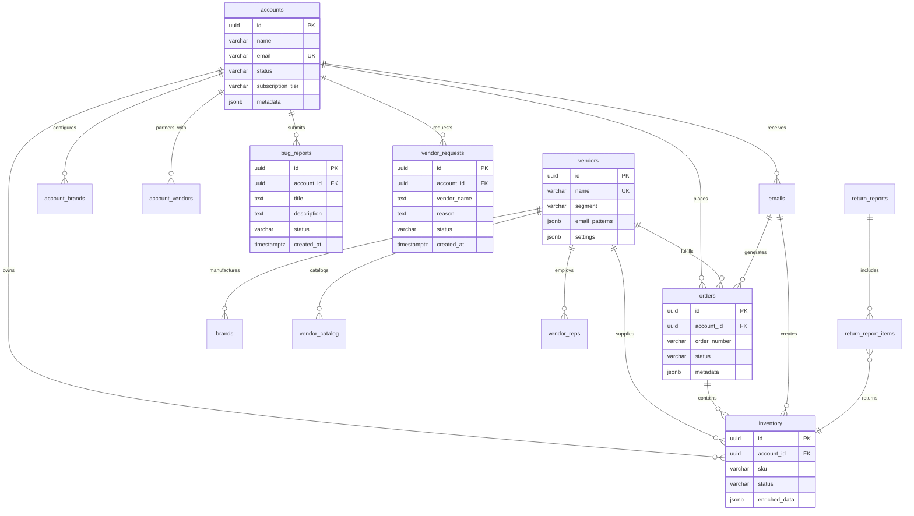

# OptiProfit Database Schema Documentation

<div align="center">
  
  **Comprehensive Database Architecture and Schema Reference**
  
  [](./DATABASE_SCHEMA.md)
  [](https://supabase.com)
  [](./DATABASE_SCHEMA.md)
  [](./DATABASE_SCHEMA.md)
  
</div>

---

## 📋 Table of Contents

- [Overview](#-overview)
- [Database Design Principles](#-database-design-principles)
- [Core Tables](#-core-tables)
- [Entity Relationships](#-entity-relationships)
- [Data Types & Constraints](#-data-types--constraints)
- [Indexes & Performance](#-indexes--performance)
- [Business Logic](#-business-logic)
- [Security & RLS](#-security--rls)
- [JSONB Usage](#-jsonb-usage)
- [Migration Scripts](#-migration-scripts)
- [Performance Optimization](#-performance-optimization)

---

## 🏗️ Overview

OptiProfit's database is built on **PostgreSQL 15** via **Supabase**, designed as a comprehensive optical inventory management system. The schema supports multi-tenant operations, vendor integrations, real-time data synchronization, and complex business workflows.

### Key Statistics

| Metric | Value |
|--------|-------|
| **Total Tables** | 16 core tables |
| **Primary Keys** | UUID v4 (distributed-friendly) |
| **Foreign Keys** | 30+ relationships |
| **Indexes** | 25+ performance indexes |
| **JSONB Columns** | 8 flexible metadata fields |
| **Check Constraints** | 20+ business rules |

### Database Features

- **🔒 Row-Level Security** - Multi-tenant data isolation
- **⚡ Real-time Subscriptions** - Live data synchronization
- **📊 JSONB Flexibility** - Schema-less metadata storage
- **🔧 Automated Functions** - Business logic enforcement
- **📈 Performance Indexes** - Optimized query patterns
- **🛡️ Data Integrity** - Comprehensive constraints

---

## 🎯 Database Design Principles

### 1. Multi-Tenant Architecture

**Account-Centric Design**: All data scoped to `account_id` for perfect tenant isolation

```sql
-- Every table includes account_id for data isolation
CREATE TABLE inventory (
  id UUID PRIMARY KEY DEFAULT uuid_generate_v4(),
  account_id UUID NOT NULL REFERENCES accounts(id) ON DELETE CASCADE,
  -- ... other columns
);

-- RLS policies ensure users only see their own data
CREATE POLICY account_isolation ON inventory
  FOR ALL TO authenticated
  USING (account_id = auth.uid());
```

### 2. Vendor-Centric Integration

**Flexible Vendor Support**: Extensible design for unlimited vendor integrations

```sql
-- Vendor configurations stored as JSONB for flexibility
CREATE TABLE vendors (
  email_patterns JSONB,     -- Dynamic email matching rules
  settings JSONB,           -- Parser configurations
  encrypted_credentials JSONB  -- Secure API authentication
);
```

### 3. Event-Driven Data Flow

**Workflow State Management**: Clear status progressions with business rules

```sql
-- Status enums enforce valid state transitions
status TEXT CHECK (status IN ('pending', 'current', 'sold', 'archived'))
```

---

## 📊 Core Tables

### 1. **accounts** - User Account Management

**Purpose**: Central multi-tenant user management with subscription tracking

```sql
CREATE TABLE accounts (
  id UUID PRIMARY KEY DEFAULT uuid_generate_v4(),
  name VARCHAR NOT NULL,
  business_name VARCHAR,
  email VARCHAR NOT NULL UNIQUE,
  phone VARCHAR,
  address TEXT,
  
  -- Geographic Information
  city VARCHAR,
  state VARCHAR,
  zip_code VARCHAR,
  country VARCHAR DEFAULT 'USA',
  timezone VARCHAR DEFAULT 'America/New_York',
  
  -- Subscription Management
  status VARCHAR DEFAULT 'active' CHECK (
    status IN ('active', 'suspended', 'cancelled', 'trial')
  ),
  subscription_tier VARCHAR DEFAULT 'basic' CHECK (
    subscription_tier IN ('trial', 'basic', 'professional', 'enterprise')
  ),
  subscription_start_date TIMESTAMPTZ,
  subscription_end_date TIMESTAMPTZ,
  trial_ends_at TIMESTAMPTZ,
  
  -- Extensible Metadata
  metadata JSONB DEFAULT '{}',
  
  -- Audit Timestamps
  created_at TIMESTAMPTZ DEFAULT CURRENT_TIMESTAMP,
  updated_at TIMESTAMPTZ DEFAULT CURRENT_TIMESTAMP
);
```

**Business Logic**:
- **Trial Management**: Automatic trial expiration handling
- **Subscription Tiers**: Feature access control based on tier
- **Geographic Localization**: Timezone-aware operations
- **Extensible Metadata**: Business-specific configurations

**Example Metadata**:
```json
{
  "preferences": {
    "default_markup": 2.5,
    "currency": "USD",
    "date_format": "MM/DD/YYYY",
    "return_window_default": 365
  },
  "business_info": {
    "license_number": "OPT-12345",
    "tax_id": "XX-XXXXXXX",
    "business_type": "optometry_practice"
  },
  "integrations": {
    "quickbooks": { "connected": true, "account_id": "QB123" },
    "shopify": { "connected": false }
  }
}
```

### 2. **vendors** - Vendor Integration Hub

**Purpose**: Comprehensive vendor management with integration configurations

```sql
CREATE TABLE vendors (
  id UUID PRIMARY KEY DEFAULT uuid_generate_v4(),
  name VARCHAR NOT NULL UNIQUE,
  
  -- Business Information
  website VARCHAR,
  support_email VARCHAR,
  support_phone VARCHAR,
  
  -- Market Classification
  segment VARCHAR CHECK (
    segment IN ('ultra-premium', 'premium', 'mid-tier', 'value', 'boutique')
  ),
  
  -- Commercial Terms
  discount_min INTEGER,
  discount_max INTEGER,
  minimum_order NUMERIC,
  payment_terms VARCHAR,
  free_shipping BOOLEAN DEFAULT false,
  buying_groups TEXT[],
  
  -- Integration Configuration
  email_patterns JSONB,
  settings JSONB,
  encrypted_credentials JSONB,
  
  -- Status Management
  is_active BOOLEAN DEFAULT true,
  supports_api BOOLEAN DEFAULT false,
  supports_parsing BOOLEAN DEFAULT false,
  
  -- Performance Metrics
  parse_success_rate NUMERIC DEFAULT 0.0,
  last_successful_parse TIMESTAMPTZ,
  
  -- Audit Timestamps
  created_at TIMESTAMPTZ DEFAULT CURRENT_TIMESTAMP,
  updated_at TIMESTAMPTZ DEFAULT CURRENT_TIMESTAMP
);
```

**Integration Patterns**:
```json
{
  "email_patterns": {
    "domains": ["safilo.com", "orders.safilo.com"],
    "signatures": ["Safilo Order Confirmation", "MySafilo"],
    "keywords": ["safilo", "order confirmation", "account number"]
  },
  "settings": {
    "parser_type": "pdf_parser",
    "date_format": "MM/DD/YYYY",
    "currency": "USD",
    "timezone": "EST",
    "confidence_threshold": 0.85
  },
  "api_config": {
    "base_url": "https://api.safilo.com/v1",
    "rate_limit": 100,
    "timeout": 30,
    "retry_attempts": 3
  }
}
```

### 3. **brands** - Product Brand Catalog

**Purpose**: Manages eyewear brands with pricing intelligence and vendor relationships

```sql
CREATE TABLE brands (
  id UUID PRIMARY KEY DEFAULT uuid_generate_v4(),
  name VARCHAR NOT NULL UNIQUE,
  vendor_id UUID REFERENCES vendors(id),
  
  -- Classification
  category VARCHAR,
  tier VARCHAR CHECK (
    tier IN ('luxury', 'premium', 'standard', 'value')
  ),
  
  -- Pricing Intelligence
  wholesale_cost NUMERIC,
  msrp NUMERIC,
  map_price NUMERIC,
  entry_level_discount NUMERIC DEFAULT 45.00,
  price_last_updated TIMESTAMPTZ,
  price_source VARCHAR,
  
  -- Brand Information
  website VARCHAR,
  is_active BOOLEAN DEFAULT true,
  notes TEXT,
  
  -- Extensible Attributes
  metadata JSONB DEFAULT '{}',
  
  -- Audit Timestamps
  created_at TIMESTAMPTZ DEFAULT CURRENT_TIMESTAMP,
  updated_at TIMESTAMPTZ DEFAULT CURRENT_TIMESTAMP
);
```

**Brand Metadata Examples**:
```json
{
  "specifications": {
    "typical_eye_sizes": ["52", "54", "56"],
    "bridge_sizes": ["16", "18", "20"],
    "temple_lengths": ["140", "145", "150"],
    "materials": ["acetate", "metal", "titanium"]
  },
  "market_position": {
    "target_demographic": "luxury_consumers",
    "price_range": "high_end",
    "brand_heritage": "italian_craftsmanship"
  },
  "compliance": {
    "fda_approved": true,
    "ce_marking": true,
    "warranty_period": "2_years"
  }
}
```

### 4. **inventory** - Core Inventory Management

**Purpose**: Central inventory tracking with detailed product specifications and lifecycle management

```sql
CREATE TABLE inventory (
  id UUID PRIMARY KEY DEFAULT uuid_generate_v4(),
  account_id UUID NOT NULL REFERENCES accounts(id) ON DELETE CASCADE,
  
  -- Product Identification
  sku VARCHAR,
  upc VARCHAR,
  brand VARCHAR,
  model VARCHAR,
  
  -- Physical Specifications
  color VARCHAR,
  color_code VARCHAR,
  eye_size VARCHAR,
  bridge_size VARCHAR,
  temple_length VARCHAR,
  size VARCHAR,  -- Combined size (e.g., "52-18-140")
  
  -- Vendor Information
  vendor_id UUID REFERENCES vendors(id),
  vendor_sku VARCHAR,
  
  -- Order Tracking
  order_id UUID REFERENCES orders(id),
  email_id UUID REFERENCES emails(id),
  order_number VARCHAR,
  
  -- Inventory Management
  quantity INTEGER DEFAULT 1,
  status VARCHAR DEFAULT 'pending' CHECK (
    status IN ('pending', 'current', 'sold', 'archived')
  ),
  
  -- Pricing Information
  wholesale_cost NUMERIC,
  retail_price NUMERIC,
  sale_price NUMERIC,
  
  -- Lifecycle Timestamps
  confirmation_date TIMESTAMPTZ,
  sale_date TIMESTAMPTZ,
  archive_date TIMESTAMPTZ,
  return_date TIMESTAMPTZ,
  
  -- Quality Assurance
  api_verified BOOLEAN DEFAULT false,
  confidence_score NUMERIC,
  last_verified TIMESTAMPTZ,
  
  -- Enriched Data
  enriched_data JSONB DEFAULT '{}',
  notes TEXT,
  
  -- Audit Timestamps
  created_at TIMESTAMPTZ DEFAULT CURRENT_TIMESTAMP,
  updated_at TIMESTAMPTZ DEFAULT CURRENT_TIMESTAMP
);
```

**Enriched Data Examples**:
```json
{
  "specifications": {
    "lens_width": "52mm",
    "bridge_width": "18mm",
    "temple_length": "145mm",
    "frame_width": "135mm",
    "frame_height": "40mm",
    "weight": "18g",
    "material": "acetate",
    "country_of_origin": "Italy",
    "gender": "unisex",
    "shape": "rectangular"
  },
  "vendor_data": {
    "api_source": "safilo_api",
    "stock_status": "in_stock",
    "estimated_delivery": "2024-01-15",
    "vendor_color_name": "Matte Black",
    "vendor_notes": "Limited edition frame"
  },
  "business_data": {
    "return_window_days": 730,
    "markup_percentage": 150,
    "popularity_score": 8.5,
    "reorder_point": 2
  }
}
```

### 5. **orders** - Order Processing System

**Purpose**: Comprehensive order lifecycle management with customer and shipping tracking

```sql
CREATE TABLE orders (
  id UUID PRIMARY KEY DEFAULT uuid_generate_v4(),
  account_id UUID NOT NULL REFERENCES accounts(id) ON DELETE CASCADE,
  
  -- Order Identification
  order_number VARCHAR NOT NULL,
  vendor_order_number VARCHAR,
  
  -- Vendor Information
  vendor_id UUID REFERENCES vendors(id),
  vendor_name VARCHAR,
  
  -- Customer Information
  customer_name VARCHAR,
  customer_email VARCHAR,
  customer_phone VARCHAR,
  
  -- Order Details
  order_date DATE,
  expected_delivery_date DATE,
  total_pieces INTEGER,
  subtotal NUMERIC,
  tax_amount NUMERIC,
  shipping_cost NUMERIC,
  total_amount NUMERIC,
  
  -- Status Management
  status VARCHAR DEFAULT 'pending' CHECK (
    status IN ('pending', 'confirmed', 'shipped', 'delivered', 'cancelled')
  ),
  
  -- Shipping Information
  shipping_method VARCHAR,
  tracking_number VARCHAR,
  shipped_date DATE,
  delivered_date DATE,
  
  -- Source Tracking
  email_id UUID REFERENCES emails(id),
  
  -- Extensible Data
  metadata JSONB DEFAULT '{}',
  notes TEXT,
  
  -- Audit Timestamps
  created_at TIMESTAMPTZ DEFAULT CURRENT_TIMESTAMP,
  updated_at TIMESTAMPTZ DEFAULT CURRENT_TIMESTAMP,
  
  UNIQUE(account_id, order_number)
);
```

### 6. **emails** - Email Processing Engine

**Purpose**: Processes incoming vendor emails for automated inventory updates

```sql
CREATE TABLE emails (
  id UUID PRIMARY KEY DEFAULT uuid_generate_v4(),
  account_id UUID NOT NULL REFERENCES accounts(id) ON DELETE CASCADE,
  
  -- Email Metadata
  message_id VARCHAR,
  from_email VARCHAR,
  to_email VARCHAR,
  subject TEXT,
  received_at TIMESTAMPTZ DEFAULT CURRENT_TIMESTAMP,
  
  -- Content Storage
  raw_data JSONB,
  plain_text TEXT,
  html_text TEXT,
  attachments_count INTEGER DEFAULT 0,
  
  -- Spam Filtering
  spam_score NUMERIC,
  spam_status VARCHAR,
  
  -- Processing Pipeline
  parse_status VARCHAR DEFAULT 'pending' CHECK (
    parse_status IN ('pending', 'processing', 'parsed', 'failed', 'ignored')
  ),
  parsed_data JSONB,
  error_message TEXT,
  
  -- Vendor Detection
  vendor_id UUID REFERENCES emails(id),
  
  -- Duplicate Handling
  duplicate_order BOOLEAN DEFAULT false,
  duplicate_message TEXT,
  
  -- Audit Timestamps
  created_at TIMESTAMPTZ DEFAULT CURRENT_TIMESTAMP,
  updated_at TIMESTAMPTZ DEFAULT CURRENT_TIMESTAMP
);
```

### 7. **bug_reports** - Bug Report Management

**Purpose**: Captures and tracks user-submitted bug reports for continuous improvement

```sql
CREATE TABLE bug_reports (
  id UUID PRIMARY KEY DEFAULT gen_random_uuid(),
  account_id UUID NOT NULL REFERENCES accounts(id) ON DELETE CASCADE,
  
  -- User Information
  user_email TEXT,
  
  -- Bug Details
  title TEXT NOT NULL,
  description TEXT NOT NULL,
  
  -- Status Tracking
  status TEXT NOT NULL DEFAULT 'new' CHECK (
    status IN ('new', 'reviewing', 'in-progress', 'resolved', 'closed')
  ),
  
  -- Timestamps
  created_at TIMESTAMPTZ NOT NULL DEFAULT now(),
  updated_at TIMESTAMPTZ DEFAULT now(),
  resolved_at TIMESTAMPTZ,
  
  -- Admin Management
  internal_notes TEXT
);

-- Performance Indexes
CREATE INDEX idx_bug_reports_account_id ON bug_reports(account_id);
CREATE INDEX idx_bug_reports_status ON bug_reports(status);
CREATE INDEX idx_bug_reports_created_at ON bug_reports(created_at DESC);
```

**Business Logic**:
- **Status Workflow**: new → reviewing → in-progress → resolved → closed
- **Account Isolation**: Users only see their own bug reports
- **Admin Visibility**: Internal notes for tracking resolution progress
- **Audit Trail**: Complete timestamp history for accountability

### 8. **vendor_requests** - Vendor Request Management

**Purpose**: Manages user requests for new vendor integrations and partnerships

```sql
CREATE TABLE vendor_requests (
  id UUID PRIMARY KEY DEFAULT gen_random_uuid(),
  account_id UUID NOT NULL REFERENCES accounts(id) ON DELETE CASCADE,
  
  -- User Information
  user_email TEXT,
  
  -- Vendor Request Details
  vendor_name TEXT NOT NULL,
  vendor_website TEXT,
  reason TEXT NOT NULL,
  
  -- Status Tracking
  status TEXT NOT NULL DEFAULT 'new' CHECK (
    status IN ('new', 'reviewing', 'in-progress', 'completed', 'rejected')
  ),
  
  -- Timestamps
  created_at TIMESTAMPTZ NOT NULL DEFAULT now(),
  updated_at TIMESTAMPTZ DEFAULT now(),
  completed_at TIMESTAMPTZ,
  
  -- Admin Management
  internal_notes TEXT
);

-- Performance Indexes
CREATE INDEX idx_vendor_requests_account_id ON vendor_requests(account_id);
CREATE INDEX idx_vendor_requests_status ON vendor_requests(status);
CREATE INDEX idx_vendor_requests_created_at ON vendor_requests(created_at DESC);
```

**Business Logic**:
- **Request Workflow**: new → reviewing → in-progress → completed/rejected
- **Vendor Research**: Website URLs help evaluate integration feasibility
- **User Justification**: Reason field captures business case for integration
- **Admin Tracking**: Internal notes for implementation progress

---

## 🔗 Entity Relationships

### Primary Relationships Diagram



### Relationship Constraints

#### 1. Account Isolation
```sql
-- All user data is isolated by account_id
CONSTRAINT fk_account_isolation 
  FOREIGN KEY (account_id) REFERENCES accounts(id) ON DELETE CASCADE
```

#### 2. Vendor Ecosystem
```sql
-- Vendor relationships maintain referential integrity
CONSTRAINT fk_vendor_brand 
  FOREIGN KEY (vendor_id) REFERENCES vendors(id) ON DELETE SET NULL
```

#### 3. Order-Inventory Linkage
```sql
-- Orders and inventory are linked for traceability
CONSTRAINT fk_order_inventory 
  FOREIGN KEY (order_id) REFERENCES orders(id) ON DELETE SET NULL
```

---

## 🎛️ Data Types & Constraints

### UUID Strategy

**Primary Keys**: All tables use `UUID` for distributed-friendly operations
```sql
id UUID PRIMARY KEY DEFAULT uuid_generate_v4()
```

**Benefits**:
- **Global Uniqueness**: No conflicts across databases
- **Security**: Non-sequential, hard to guess
- **Scalability**: Supports distributed architecture
- **Performance**: Indexed efficiently in PostgreSQL

### Timestamp Management

**Consistent Timestamps**: All tables include audit trails
```sql
created_at TIMESTAMPTZ DEFAULT CURRENT_TIMESTAMP,
updated_at TIMESTAMPTZ DEFAULT CURRENT_TIMESTAMP
```

**Auto-Update Triggers**:
```sql
-- Automatically update updated_at on row changes
CREATE TRIGGER update_updated_at_column
  BEFORE UPDATE ON table_name
  FOR EACH ROW EXECUTE FUNCTION update_updated_at_column();
```

### Numeric Precision

**Financial Values**: Use `NUMERIC` for exact decimal precision
```sql
wholesale_cost NUMERIC,    -- No floating-point errors
retail_price NUMERIC,      -- Exact currency calculations
discount_percentage NUMERIC -- Precise percentage storage
```

**Benefits**:
- **Accuracy**: No rounding errors in financial calculations
- **Compliance**: Required for accounting and tax purposes
- **Precision**: Maintains exact decimal values

### Check Constraints

**Status Enumerations**: Enforce valid state transitions
```sql
-- Inventory status workflow
status VARCHAR CHECK (status IN ('pending', 'current', 'sold', 'archived'))

-- Subscription tiers with clear hierarchy
subscription_tier VARCHAR CHECK (
  subscription_tier IN ('trial', 'basic', 'professional', 'enterprise')
)

-- Order status lifecycle
status VARCHAR CHECK (
  status IN ('pending', 'confirmed', 'shipped', 'delivered', 'cancelled')
)
```

**Business Rules**: Enforce data quality
```sql
-- Ensure positive quantities
quantity INTEGER CHECK (quantity >= 0)

-- Validate email formats (application-level validation preferred)
email VARCHAR CHECK (email ~* '^[A-Za-z0-9._%+-]+@[A-Za-z0-9.-]+\.[A-Za-z]{2,}$')

-- Ensure valid percentage ranges
discount_percentage NUMERIC CHECK (discount_percentage >= 0 AND discount_percentage <= 100)
```

---

## 📈 Indexes & Performance

### Strategic Indexing

#### 1. Account-Based Queries
```sql
-- Primary filtering by account for multi-tenant queries
CREATE INDEX idx_inventory_account_status ON inventory(account_id, status);
CREATE INDEX idx_orders_account_status ON orders(account_id, status);
CREATE INDEX idx_emails_account_parse_status ON emails(account_id, parse_status);
```

#### 2. Vendor Operations
```sql
-- Vendor-specific data access patterns
CREATE INDEX idx_inventory_vendor_brand ON inventory(vendor_id, brand);
CREATE INDEX idx_vendor_catalog_vendor_brand ON vendor_catalog(vendor_id, brand_name);
CREATE INDEX idx_api_logs_vendor_created ON api_logs(vendor_id, created_at);
```

#### 3. Time-Based Queries
```sql
-- Chronological data access for reporting
CREATE INDEX idx_inventory_created_at ON inventory(created_at);
CREATE INDEX idx_orders_order_date ON orders(order_date);
CREATE INDEX idx_emails_received_at ON emails(received_at);
```

#### 4. Search and Filtering
```sql
-- Product search and identification
CREATE INDEX idx_inventory_sku ON inventory(sku);
CREATE INDEX idx_inventory_upc ON inventory(upc);
CREATE INDEX idx_brand_name_trgm ON brands USING gin(name gin_trgm_ops);
```

#### 5. Return Management
```sql
-- Return window calculations and reporting
CREATE INDEX idx_return_reports_account_status ON return_reports(account_id, status);
CREATE INDEX idx_return_report_items_report_id ON return_report_items(report_id);
```

### Performance Optimization Strategies

#### 1. Partial Indexes
```sql
-- Index only active records for better performance
CREATE INDEX idx_inventory_current_status 
ON inventory(account_id, created_at) 
WHERE status = 'current';

-- Index only failed parses for debugging
CREATE INDEX idx_emails_failed_parse 
ON emails(account_id, error_message) 
WHERE parse_status = 'failed';
```

#### 2. Composite Indexes
```sql
-- Support complex filtering queries
CREATE INDEX idx_inventory_account_vendor_status_created 
ON inventory(account_id, vendor_id, status, created_at);
```

#### 3. JSONB Indexing
```sql
-- Index JSONB fields for metadata queries
CREATE INDEX idx_inventory_enriched_data_gin 
ON inventory USING gin(enriched_data);

-- Index specific JSONB keys
CREATE INDEX idx_brands_metadata_tier 
ON brands USING gin((metadata->'market_position'));
```

---

## 🧠 Business Logic

### Automated Functions

#### 1. Return Report Number Generation
```sql
CREATE OR REPLACE FUNCTION generate_return_report_number()
RETURNS TEXT AS $$
DECLARE
  year_part TEXT;
  sequence_part TEXT;
  next_number INTEGER;
BEGIN
  year_part := EXTRACT(YEAR FROM CURRENT_DATE)::TEXT;
  
  SELECT COALESCE(MAX(
    SUBSTRING(report_number FROM 'RR-\d{4}-(\d+)')::INTEGER
  ), 0) + 1
  INTO next_number
  FROM return_reports
  WHERE report_number LIKE 'RR-' || year_part || '-%';
  
  sequence_part := LPAD(next_number::TEXT, 4, '0');
  
  RETURN 'RR-' || year_part || '-' || sequence_part;
END;
$$ LANGUAGE plpgsql;
```

#### 2. New User Account Creation
```sql
CREATE OR REPLACE FUNCTION handle_new_user()
RETURNS TRIGGER AS $$
BEGIN
  INSERT INTO accounts (id, email, name)
  VALUES (
    NEW.id,
    NEW.email,
    COALESCE(NEW.raw_user_meta_data->>'first_name', 'New User')
  );
  RETURN NEW;
END;
$$ LANGUAGE plpgsql SECURITY DEFINER;

-- Trigger on auth.users table
CREATE TRIGGER on_auth_user_created
  AFTER INSERT ON auth.users
  FOR EACH ROW EXECUTE FUNCTION handle_new_user();
```

#### 3. Updated Timestamp Maintenance
```sql
CREATE OR REPLACE FUNCTION update_updated_at_column()
RETURNS TRIGGER AS $$
BEGIN
  NEW.updated_at = CURRENT_TIMESTAMP;
  RETURN NEW;
END;
$$ LANGUAGE plpgsql;

-- Apply to all tables with updated_at column
CREATE TRIGGER update_accounts_updated_at
  BEFORE UPDATE ON accounts
  FOR EACH ROW EXECUTE FUNCTION update_updated_at_column();
```

### Status Workflow Management

#### 1. Inventory Lifecycle
```sql
-- Valid status transitions for inventory
pending → current    (order confirmation)
current → sold       (sale transaction)
current → archived   (remove from active)
sold → current       (return processing)
archived → current   (restore item)
```

#### 2. Order Processing
```sql
-- Order status progression
pending → confirmed → shipped → delivered
pending → cancelled (at any point)
```

#### 3. Email Processing Pipeline
```sql
-- Email processing states
pending → processing → parsed (successful)
pending → processing → failed (parsing error)
pending → ignored (spam or irrelevant)
```

---

## 🔒 Security & RLS

### Row-Level Security Policies

#### 1. Account Data Isolation
```sql
-- Users can only access their own account data
CREATE POLICY account_isolation ON inventory
  FOR ALL TO authenticated
  USING (account_id = auth.uid());

CREATE POLICY account_isolation ON orders
  FOR ALL TO authenticated  
  USING (account_id = auth.uid());

CREATE POLICY account_isolation ON emails
  FOR ALL TO authenticated
  USING (account_id = auth.uid());
```

#### 2. Service Role Bypass
```sql
-- Service role can access all data for backend operations
CREATE POLICY service_role_access ON inventory
  FOR ALL TO service_role
  USING (true);
```

#### 3. Public Data Access
```sql
-- Vendors and brands are globally readable
CREATE POLICY public_vendors ON vendors
  FOR SELECT TO authenticated
  USING (true);

CREATE POLICY public_brands ON brands
  FOR SELECT TO authenticated
  USING (true);
```

### Data Protection

#### 1. Sensitive Data Encryption
```sql
-- Encrypted credentials for vendor APIs
encrypted_credentials JSONB  -- Encrypted at application level
```

#### 2. Audit Logging
```sql
-- Comprehensive audit trail for all operations
api_logs (endpoint, method, account_id, request_data, response_data, created_at)
```

#### 3. Data Retention
```sql
-- Automatic cleanup policies for old data
DELETE FROM api_logs WHERE created_at < NOW() - INTERVAL '90 days';
DELETE FROM emails WHERE created_at < NOW() - INTERVAL '1 year' AND parse_status = 'parsed';
```

---

## 📦 JSONB Usage

### 1. Account Metadata
```json
{
  "preferences": {
    "default_markup": 2.5,
    "currency": "USD",
    "date_format": "MM/DD/YYYY",
    "return_window_default": 365,
    "notification_settings": {
      "email_on_new_order": true,
      "email_on_low_stock": false,
      "email_on_return_window": true
    }
  },
  "business_info": {
    "license_number": "OPT-12345",
    "tax_id": "XX-XXXXXXX",
    "business_type": "optometry_practice",
    "established_year": 2015,
    "employee_count": 8
  },
  "integrations": {
    "quickbooks": {
      "connected": true,
      "account_id": "QB123",
      "last_sync": "2024-01-15T10:30:00Z"
    },
    "shopify": {
      "connected": false,
      "requested_at": "2024-01-10T14:20:00Z"
    }
  },
  "trial_data": {
    "features_used": ["inventory", "orders", "calculator"],
    "demo_completed": true,
    "conversion_likelihood": 0.85
  }
}
```

### 2. Vendor Configuration
```json
{
  "email_patterns": {
    "domains": ["safilo.com", "orders.safilo.com", "noreply@safilo.com"],
    "signatures": [
      "Safilo Order Confirmation",
      "MySafilo Order",
      "Your Safilo Order"
    ],
    "keywords": [
      "safilo", "order confirmation", "account number",
      "MySafilo", "order details", "shipping information"
    ]
  },
  "settings": {
    "parser_type": "pdf_parser",
    "date_format": "MM/DD/YYYY",
    "currency": "USD",
    "timezone": "EST",
    "confidence_threshold": 0.85,
    "auto_confirm": false,
    "requires_review": true
  },
  "api_config": {
    "base_url": "https://api.safilo.com/v1",
    "rate_limit": 100,
    "timeout": 30,
    "retry_attempts": 3,
    "backoff_strategy": "exponential"
  },
  "enrichment": {
    "supports_api": true,
    "supports_web_scraping": false,
    "api_endpoints": {
      "product_lookup": "/products/{sku}",
      "inventory_check": "/inventory/{sku}",
      "price_list": "/pricing"
    }
  }
}
```

### 3. Inventory Enriched Data
```json
{
  "specifications": {
    "lens_width": "52mm",
    "bridge_width": "18mm",
    "temple_length": "145mm",
    "frame_width": "135mm",
    "frame_height": "40mm",
    "weight": "18g",
    "material": "acetate",
    "country_of_origin": "Italy",
    "gender": "unisex",
    "shape": "rectangular",
    "rim_type": "full_rim",
    "bridge_type": "regular",
    "temple_type": "straight"
  },
  "vendor_data": {
    "api_source": "safilo_api",
    "stock_status": "in_stock",
    "estimated_delivery": "2024-01-15",
    "vendor_color_name": "Matte Black",
    "vendor_sku": "CA8801-003",
    "vendor_notes": "Limited edition frame",
    "last_updated": "2024-01-10T15:30:00Z",
    "confidence_score": 0.95
  },
  "business_data": {
    "return_window_days": 730,
    "markup_percentage": 150,
    "popularity_score": 8.5,
    "reorder_point": 2,
    "average_sale_time": 45,
    "profit_margin": 65.5,
    "sales_velocity": "high"
  },
  "compliance": {
    "fda_approved": true,
    "ce_marking": true,
    "impact_resistant": true,
    "uv_protection": "100%",
    "warranty_period": "2_years"
  }
}
```

### 4. Order Metadata
```json
{
  "shipping": {
    "method": "fedex_ground",
    "tracking_number": "1234567890",
    "estimated_delivery": "2024-01-20",
    "shipping_cost": 15.99,
    "insurance_value": 500.00
  },
  "customer": {
    "customer_id": "CUST-12345",
    "prescription": {
      "od_sphere": "-2.25",
      "od_cylinder": "-0.50",
      "od_axis": "180",
      "os_sphere": "-2.00",
      "os_cylinder": "-0.75",
      "os_axis": "175",
      "pd": "62"
    },
    "frame_adjustments": [
      "nose_pad_adjustment",
      "temple_adjustment"
    ]
  },
  "vendor_specific": {
    "safilo_order_type": "stock_order",
    "rep_name": "John Smith",
    "rep_email": "john.smith@safilo.com",
    "special_instructions": "Rush order - needed for patient appointment",
    "volume_discount": 5.0
  },
  "processing": {
    "parsed_at": "2024-01-15T10:30:00Z",
    "confirmed_at": "2024-01-15T11:00:00Z",
    "parser_version": "v2.1.0",
    "enrichment_sources": ["safilo_api", "web_scraping"]
  }
}
```

---

## 🔄 Migration Scripts

### Migration History

#### Migration 006: Vendor Reps and Return Reports
```sql
-- Add vendor representatives table
CREATE TABLE vendor_reps (
  id UUID PRIMARY KEY DEFAULT gen_random_uuid(),
  account_id UUID NOT NULL REFERENCES accounts(id) ON DELETE CASCADE,
  vendor_id UUID NOT NULL REFERENCES vendors(id) ON DELETE CASCADE,
  name TEXT NOT NULL,
  email TEXT,
  phone TEXT,
  is_primary BOOLEAN DEFAULT false,
  created_at TIMESTAMPTZ DEFAULT now(),
  updated_at TIMESTAMPTZ DEFAULT now()
);

-- Add return reports functionality
CREATE TABLE return_reports (
  id UUID PRIMARY KEY DEFAULT gen_random_uuid(),
  account_id UUID NOT NULL REFERENCES accounts(id) ON DELETE CASCADE,
  vendor_id UUID NOT NULL REFERENCES vendors(id),
  report_number TEXT NOT NULL UNIQUE DEFAULT generate_return_report_number(),
  report_date DATE DEFAULT CURRENT_DATE,
  status TEXT DEFAULT 'draft' CHECK (status IN ('draft', 'generated', 'sent', 'cancelled')),
  total_items INTEGER DEFAULT 0,
  total_refund NUMERIC DEFAULT 0.00,
  created_at TIMESTAMPTZ DEFAULT now(),
  updated_at TIMESTAMPTZ DEFAULT now()
);

CREATE TABLE return_report_items (
  id UUID PRIMARY KEY DEFAULT gen_random_uuid(),
  report_id UUID NOT NULL REFERENCES return_reports(id) ON DELETE CASCADE,
  inventory_id UUID NOT NULL REFERENCES inventory(id),
  reason TEXT,
  refund_amount NUMERIC DEFAULT 0.00,
  created_at TIMESTAMPTZ DEFAULT now()
);
```

#### Migration 007: Inventory Status Constraint Fix
```sql
-- Update inventory status constraint to include new states
ALTER TABLE inventory DROP CONSTRAINT IF EXISTS inventory_status_check;
ALTER TABLE inventory ADD CONSTRAINT inventory_status_check 
  CHECK (status IN ('pending', 'current', 'sold', 'archived'));
```

#### Migration 008: New User Signup Handling
```sql
-- Function to handle new user account creation
CREATE OR REPLACE FUNCTION handle_new_user_signup()
RETURNS TRIGGER AS $$
BEGIN
  INSERT INTO accounts (id, email, name)
  VALUES (
    NEW.id,
    NEW.email,
    COALESCE(
      NEW.raw_user_meta_data->>'first_name',
      SPLIT_PART(NEW.email, '@', 1)
    )
  );
  RETURN NEW;
END;
$$ LANGUAGE plpgsql SECURITY DEFINER;

-- Trigger for automatic account creation
CREATE TRIGGER on_auth_user_created
  AFTER INSERT ON auth.users
  FOR EACH ROW EXECUTE FUNCTION handle_new_user_signup();
```

#### Migration 009: Realtime Subscriptions
```sql
-- Enable realtime for key tables
ALTER PUBLICATION supabase_realtime ADD TABLE orders;
ALTER PUBLICATION supabase_realtime ADD TABLE inventory;
ALTER PUBLICATION supabase_realtime ADD TABLE emails;
ALTER PUBLICATION supabase_realtime ADD TABLE return_reports;

-- Add RLS policies for realtime
CREATE POLICY realtime_orders ON orders FOR SELECT TO authenticated USING (auth.uid() = account_id);
CREATE POLICY realtime_inventory ON inventory FOR SELECT TO authenticated USING (auth.uid() = account_id);
CREATE POLICY realtime_emails ON emails FOR SELECT TO authenticated USING (auth.uid() = account_id);
```

#### Migration 010: Feedback System Tables
```sql
-- Create bug_reports table
CREATE TABLE bug_reports (
  id uuid PRIMARY KEY DEFAULT gen_random_uuid(),
  account_id uuid NOT NULL REFERENCES accounts(id) ON DELETE CASCADE,
  user_email text,
  title text NOT NULL,
  description text NOT NULL,
  status text NOT NULL DEFAULT 'new' CHECK (status IN ('new', 'reviewing', 'in-progress', 'resolved', 'closed')),
  created_at timestamptz NOT NULL DEFAULT now(),
  updated_at timestamptz DEFAULT now(),
  resolved_at timestamptz,
  internal_notes text
);

-- Create vendor_requests table
CREATE TABLE vendor_requests (
  id uuid PRIMARY KEY DEFAULT gen_random_uuid(),
  account_id uuid NOT NULL REFERENCES accounts(id) ON DELETE CASCADE,
  user_email text,
  vendor_name text NOT NULL,
  vendor_website text,
  reason text NOT NULL,
  status text NOT NULL DEFAULT 'new' CHECK (status IN ('new', 'reviewing', 'in-progress', 'completed', 'rejected')),
  created_at timestamptz NOT NULL DEFAULT now(),
  updated_at timestamptz DEFAULT now(),
  completed_at timestamptz,
  internal_notes text
);

-- Add indexes and RLS policies
CREATE INDEX idx_bug_reports_account_id ON bug_reports(account_id);
CREATE INDEX idx_vendor_requests_account_id ON vendor_requests(account_id);

ALTER TABLE bug_reports ENABLE ROW LEVEL SECURITY;
ALTER TABLE vendor_requests ENABLE ROW LEVEL SECURITY;

-- RLS policies for bug_reports
CREATE POLICY "Users can view their own bug reports" ON bug_reports FOR SELECT USING (auth.uid() = account_id);
CREATE POLICY "Users can create bug reports" ON bug_reports FOR INSERT WITH CHECK (auth.uid() = account_id);

-- RLS policies for vendor_requests  
CREATE POLICY "Users can view their own vendor requests" ON vendor_requests FOR SELECT USING (auth.uid() = account_id);
CREATE POLICY "Users can create vendor requests" ON vendor_requests FOR INSERT WITH CHECK (auth.uid() = account_id);
```

---

## ⚡ Performance Optimization

### Query Optimization Patterns

#### 1. Efficient Inventory Queries
```sql
-- Optimized query for current inventory with vendor information
SELECT 
  i.id,
  i.sku,
  i.brand,
  i.model,
  i.color,
  i.size,
  i.status,
  v.name as vendor_name,
  (i.enriched_data->>'specifications'->>'material') as material,
  EXTRACT(DAYS FROM (CURRENT_DATE - i.confirmation_date)) as days_in_inventory
FROM inventory i
LEFT JOIN vendors v ON i.vendor_id = v.id
WHERE i.account_id = $1 
  AND i.status = 'current'
ORDER BY i.created_at DESC
LIMIT 50 OFFSET $2;
```

#### 2. Return Window Calculations
```sql
-- Efficient return window query with proper indexing
SELECT 
  i.*,
  ab.return_window_days,
  (i.confirmation_date + INTERVAL '1 day' * ab.return_window_days) as return_deadline,
  GREATEST(0, EXTRACT(DAYS FROM (
    (i.confirmation_date + INTERVAL '1 day' * ab.return_window_days) - CURRENT_DATE
  ))) as days_remaining
FROM inventory i
JOIN account_brands ab ON i.account_id = ab.account_id 
  AND i.brand = (SELECT name FROM brands WHERE id = ab.brand_id)
WHERE i.account_id = $1 
  AND i.status = 'current'
  AND i.confirmation_date IS NOT NULL
ORDER BY days_remaining ASC;
```

#### 3. Vendor Performance Analytics
```sql
-- Vendor processing success rates with proper aggregation
SELECT 
  v.name,
  COUNT(e.id) as total_emails,
  COUNT(CASE WHEN e.parse_status = 'parsed' THEN 1 END) as successful_parses,
  ROUND(
    COUNT(CASE WHEN e.parse_status = 'parsed' THEN 1 END)::NUMERIC / 
    NULLIF(COUNT(e.id), 0) * 100, 2
  ) as success_rate,
  AVG(EXTRACT(EPOCH FROM (e.updated_at - e.created_at))) as avg_processing_time
FROM vendors v
LEFT JOIN emails e ON v.id = e.vendor_id
WHERE e.created_at >= CURRENT_DATE - INTERVAL '30 days'
GROUP BY v.id, v.name
ORDER BY success_rate DESC;
```

### Maintenance Procedures

#### 1. Index Maintenance
```sql
-- Reindex heavily used tables weekly
REINDEX TABLE CONCURRENTLY inventory;
REINDEX TABLE CONCURRENTLY orders;
REINDEX TABLE CONCURRENTLY emails;

-- Update table statistics for query planner
ANALYZE inventory;
ANALYZE orders;
ANALYZE emails;
```

#### 2. Data Cleanup
```sql
-- Clean up old API logs (keep 90 days)
DELETE FROM api_logs 
WHERE created_at < CURRENT_DATE - INTERVAL '90 days';

-- Archive old emails (keep 1 year)
UPDATE emails 
SET parse_status = 'archived'
WHERE created_at < CURRENT_DATE - INTERVAL '1 year'
  AND parse_status = 'parsed';

-- Clean up orphaned records
DELETE FROM inventory 
WHERE order_id IS NOT NULL 
  AND NOT EXISTS (SELECT 1 FROM orders WHERE id = inventory.order_id);
```

#### 3. Performance Monitoring
```sql
-- Query to identify slow queries
SELECT 
  query,
  calls,
  total_time,
  rows,
  100.0 * shared_blks_hit / nullif(shared_blks_hit + shared_blks_read, 0) AS hit_percent
FROM pg_stat_statements 
ORDER BY total_time DESC 
LIMIT 10;

-- Table size monitoring
SELECT 
  schemaname,
  tablename,
  pg_size_pretty(pg_total_relation_size(schemaname||'.'||tablename)) as size,
  pg_total_relation_size(schemaname||'.'||tablename) as size_bytes
FROM pg_tables 
WHERE schemaname = 'public'
ORDER BY size_bytes DESC;
```

---

## 📚 Reference Links

### Related Documentation
- [System Architecture](./SYSTEM_ARCHITECTURE.md) - Overall system design
- [API Endpoints](./API_ENDPOINTS.md) - REST API reference
- [Security Guide](../security/SECURITY.md) - Security implementation

### External Resources
- [PostgreSQL Documentation](https://www.postgresql.org/docs/)
- [Supabase Database Guide](https://supabase.com/docs/guides/database)
- [JSONB Best Practices](https://www.postgresql.org/docs/current/datatype-json.html)

---

*This database schema documentation provides comprehensive technical details for the OptiProfit system. For implementation guidance, refer to the migration scripts and setup procedures in the project repository.*

*Last Updated: 2024-01-15*  
*Schema Version: 1.0*  
*Total Tables: 14*  
*Maintained by: OptiProfit Engineering Team*