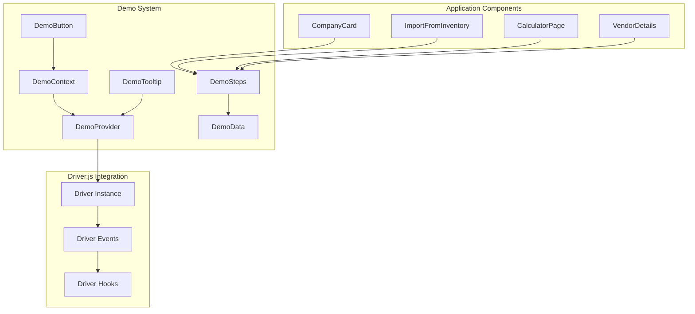

# Demo System Implementation SOP

<div align="center">
  
  **Standard Operating Procedure: Interactive Demo System**
  
  [](./DEMO_SYSTEM_IMPLEMENTATION.md)
  [](./DEMO_SYSTEM_IMPLEMENTATION.md)
  [](./DEMO_SYSTEM_IMPLEMENTATION.md)
  [](./DEMO_SYSTEM_IMPLEMENTATION.md)
  
</div>

---

## 📋 Table of Contents

- [Overview](#-overview)
- [System Architecture](#-system-architecture)
- [Implementation Details](#-implementation-details)
- [14-Step Demo Flow](#-14-step-demo-flow)
- [Technical Components](#-technical-components)
- [Data Management](#-data-management)
- [User Experience](#-user-experience)
- [Development Guidelines](#-development-guidelines)
- [Testing & Quality Assurance](#-testing--quality-assurance)
- [Maintenance & Updates](#-maintenance--updates)

---

## 🎯 Overview

### Purpose
The Interactive Demo System provides a comprehensive guided tour of OptiProfit's complete workflow, from vendor email parsing to profit calculations, showcasing the platform's value proposition through a 14-step interactive experience.

### Key Objectives
- **Product Demonstration**: Showcase core features and workflow
- **User Onboarding**: Guide new users through platform capabilities
- **Value Proposition**: Demonstrate ROI and efficiency gains
- **Professional Presentation**: Maintain brand standards and polish

### Technology Stack
| Component | Technology | Purpose |
|-----------|------------|---------|
| **Tour Engine** | Driver.js | Step-by-step guidance and element highlighting |
| **Animations** | Framer Motion | Smooth transitions and spring physics |
| **State Management** | React Context | Demo state and data management |
| **Styling** | Tailwind CSS + Custom CSS | Design system compliance |
| **Type Safety** | TypeScript | Full type coverage for demo components |

---

## 🏗️ System Architecture

### High-Level Architecture



### File Structure

```
src/
├── demo/
│   ├── mockData.ts              # Demo data fixtures
│   ├── demoSteps.ts             # 14-step configuration
│   ├── demoUtils.ts             # Navigation utilities
│   └── README.md                # Demo documentation
├── contexts/
│   └── DemoContext.tsx          # Demo state management
├── components/demo/
│   ├── DemoProvider.tsx         # Driver.js integration
│   ├── DemoTooltip.tsx          # Custom tooltip component
│   └── DemoButton.tsx           # Watch Demo button
├── hooks/
│   └── useDemo.ts               # Demo hooks and utilities
└── styles/
    └── demo.css                 # Demo-specific styles
```

---

## 🔧 Implementation Details

### 1. Driver.js Integration

#### Installation & Setup
```bash
npm install driver.js
```

#### Core Configuration
```typescript
// demoSteps.ts
export const demoSteps: ExtendedDemoStep[] = [
  {
    id: 'welcome',
    page: '/frames/inventory',
    popover: {
      title: 'Welcome to OptiProfit Demo! 🎉',
      description: 'Discover automated workflow...',
      side: 'center',
      align: 'center'
    },
    requiresNavigation: true
  },
  // ... 13 more steps
];
```

#### Driver Instance Management
```typescript
// DemoProvider.tsx
const driverConfig: Config = {
  showProgress: false,
  showButtons: [],
  disableActiveInteraction: false,
  allowClose: false,
  overlayColor: 'rgba(0, 0, 0, 0.6)',
  popoverClass: 'demo-popover',
  
  onHighlightStarted: (element, step) => {
    // Handle navigation and spotlight effects
  },
  
  onPopoverRender: (popover, { config, state }) => {
    // Render custom tooltip with Framer Motion
  }
};
```

### 2. State Management

#### Demo Context Structure
```typescript
export interface DemoState {
  isActive: boolean;
  isLoading: boolean;
  currentStep: number;
  totalSteps: number;
  demoData: DemoData | null;
  originalUserData: any | null;
}

export interface DemoContextType extends DemoState {
  startDemo: () => void;
  nextStep: () => void;
  previousStep: () => void;
  skipDemo: () => void;
  goToStep: (step: number) => void;
  endDemo: () => void;
  injectDemoData: () => void;
  restoreUserData: () => void;
}
```

#### Demo Data Injection
```typescript
// Demo data stored in sessionStorage for component access
const injectDemoData = useCallback(() => {
  setState(prev => ({ ...prev, demoData: DEMO_DATA }));
  sessionStorage.setItem('demoData', JSON.stringify(DEMO_DATA));
  sessionStorage.setItem('isDemoMode', 'true');
}, []);
```

### 3. Custom Components

#### DemoTooltip with Framer Motion
```typescript
const buttonVariants = {
  idle: { scale: 1, boxShadow: '0 4px 14px 0 rgba(59, 130, 246, 0.3)' },
  hover: { 
    scale: 1.02, 
    boxShadow: '0 6px 20px 0 rgba(59, 130, 246, 0.4)',
    transition: { type: 'spring', stiffness: 400, damping: 10 }
  },
  tap: { scale: 0.98 }
};
```

#### Progress Indicator
```typescript
<div className="w-full bg-gray-200 rounded-full h-2">
  <motion.div
    className="bg-blue-600 h-2 rounded-full"
    initial={{ width: 0 }}
    animate={{ width: `${progress}%` }}
    transition={{ duration: 0.5, ease: 'easeOut' }}
  />
</div>
```

---

## 📋 14-Step Demo Flow

### Complete Workflow Overview

| Step | Phase | Focus | Page | Element Target |
|------|-------|-------|------|----------------|
| 1 | **Introduction** | Welcome & Overview | `/frames/inventory` | Center Modal |
| 2 | **Email Processing** | Pending Orders | `/frames/inventory` | `[data-demo="pending-tab"]` |
| 3 | **Inventory Lifecycle** | Pending → Current | `/frames/inventory` | `[data-demo="inventory-pending-tab"]` |
| 4 | **Vendor Management** | Auto-Import | `/brands` | `[data-demo="vendor-card"]` |
| 5 | **Vendor Display** | Account Numbers | `/brands` | `[data-demo="vendor-card"]` |
| 6 | **Pricing Setup** | Edit Vendor | `/brands` | `[data-demo="edit-vendor-btn"]` |
| 7 | **Calculator Intro** | Profit Features | `/calculator` | Center Modal |
| 8 | **Company Selection** | Dropdown Demo | `/calculator` | `[data-demo="company-dropdown"]` |
| 9 | **Brand Selection** | Filtered Options | `/calculator` | `[data-demo="brand-dropdown"]` |
| 10 | **Auto-Population** | Cost Fields | `/calculator` | `[data-demo="cost-fields"]` |
| 11 | **Price Input** | Retail Price | `/calculator` | `[data-demo="retail-price"]` |
| 12 | **Profit Display** | Live Calculations | `/calculator` | `[data-demo="profit-display"]` |
| 13 | **Comparison Mode** | Side-by-Side | `/calculator` | `[data-demo="comparison-tab"]` |
| 14 | **Completion** | Success & Cleanup | `/calculator` | Center Modal |

### Detailed Step Configurations

#### Step 1: Welcome Modal
```typescript
{
  id: 'welcome',
  page: '/frames/inventory',
  popover: {
    title: 'Welcome to OptiProfit Demo! 🎉',
    description: `
      <div class="space-y-3">
        <p>Discover how OptiProfit transforms your optical business...</p>
        <ul class="list-disc list-inside space-y-1 text-sm">
          <li>Automated vendor email processing</li>
          <li>Frame lifecycle management</li>
          <li>Real-time profit calculations</li>
        </ul>
      </div>
    `,
    side: 'center',
    align: 'center'
  },
  requiresNavigation: true
}
```

#### Step 8: Company Selection (Interactive)
```typescript
{
  id: 'company-dropdown',
  page: '/calculator',
  element: '[data-demo="company-dropdown"]',
  popover: {
    title: 'Step 6: Select Vendor',
    description: 'Click the Company dropdown and select "Modern Optical"...',
    side: 'bottom',
    align: 'start'
  }
}
```

---

## 🧩 Technical Components

### 1. DemoProvider Component

#### Purpose
Orchestrates the entire demo experience, managing Driver.js instance and handling step progression.

#### Key Features
- **Driver.js Integration**: Creates and manages driver instance
- **Route Navigation**: Automatic page transitions
- **Event Handling**: Step progression and user interactions
- **Cleanup Management**: Data restoration on demo exit

#### Implementation
```typescript
const DemoProvider: React.FC<DemoProviderProps> = ({ children }) => {
  const navigate = useNavigate();
  const location = useLocation();
  const driverRef = useRef<Driver | null>(null);
  
  useEffect(() => {
    if (isActive && !driverRef.current) {
      const driverInstance = driver(driverConfig);
      driverRef.current = driverInstance;
      demoController.setDriver(driverInstance);
      demoController.enableKeyboardNavigation();
      driverInstance.drive();
    }
  }, [isActive, currentStep, location.pathname]);
  
  return <>{children}</>;
};
```

### 2. DemoTooltip Component

#### Purpose
Custom tooltip component with Framer Motion animations and interactive controls.

#### Features
- **Progress Visualization**: Step counter and progress bar
- **Navigation Controls**: Previous/Next/Skip buttons
- **Keyboard Hints**: Visual indicators for shortcuts
- **Responsive Design**: Adapts to different screen sizes

#### Animation System
```typescript
const getAnimationVariants = () => {
  const baseVariants = {
    initial: { opacity: 0, scale: 0.9 },
    animate: { 
      opacity: 1, 
      scale: 1,
      transition: { type: 'spring', stiffness: 300, damping: 25 }
    },
    exit: { opacity: 0, scale: 0.9 }
  };
  
  // Position-specific animations...
};
```

### 3. DemoButton Component

#### Purpose
Animated button to trigger demo start with visual feedback.

#### Features
- **Sparkle Animation**: Rotating icon on hover
- **Shine Effect**: Animated overlay on interaction
- **Auto-Hide**: Disappears when demo is active
- **Multiple Variants**: Primary, outline, ghost styles

### 4. Demo Data Management

#### Mock Data Structure
```typescript
export const DEMO_VENDOR: Company = {
  id: 'demo-modern-optical',
  name: 'Modern Optical',
  accountNumber: 'MO-12345',
  brands: [
    {
      id: 'demo-modern-collection',
      name: 'Modern Optics Collection',
      wholesale_cost: 85,
      msrp: 150,
      // ... complete brand data
    }
  ]
};
```

#### Data Injection Strategy
1. **Session Storage**: Temporary storage for demo data
2. **Component Access**: Components check for demo mode
3. **Data Isolation**: Complete separation from real user data
4. **Automatic Cleanup**: Removal on demo completion

---

## 💾 Data Management

### Demo Data Architecture

#### Modern Optical Demo Vendor
```typescript
const DEMO_VENDOR = {
  name: "Modern Optical",
  accountNumber: "MO-12345",
  brands: [
    {
      name: "Modern Optics Collection",
      wholesale_cost: 85,
      your_cost: 55,
      retail_price: 150,
      tariff_tax: 3,
      margin: 61.3%
    }
  ]
};
```

#### Demo Order Data
```typescript
const DEMO_ORDER = {
  order_number: "MO-2024-DEMO",
  vendor: "Modern Optical",
  customer_name: "Downtown Vision Center",
  total_pieces: 3,
  account_number: "MO-12345",
  items: [/* frame items */]
};
```

### Data Flow Strategy

#### 1. Injection Process
```typescript
// On demo start
sessionStorage.setItem('demoData', JSON.stringify(DEMO_DATA));
sessionStorage.setItem('isDemoMode', 'true');
```

#### 2. Component Access
```typescript
// Components check for demo mode
const useDemoDataInjection = () => {
  const getSessionDemoData = () => {
    const data = sessionStorage.getItem('demoData');
    const isDemoMode = sessionStorage.getItem('isDemoMode') === 'true';
    return isDemoMode && data ? JSON.parse(data) : null;
  };
  
  return { isDemo: !!sessionDemoData, demoData: sessionDemoData };
};
```

#### 3. Cleanup Process
```typescript
// On demo end
sessionStorage.removeItem('demoData');
sessionStorage.removeItem('isDemoMode');
```

---

## 🎨 User Experience

### Visual Design Principles

#### 1. Professional Aesthetics
- **Color Scheme**: Primary blue (#2563eb) with gradient overlays
- **Typography**: Inter font family for consistency
- **Spacing**: 4px base unit following Tailwind scale
- **Animation Timing**: 300ms transitions with spring physics

#### 2. Interactive Feedback
- **Hover States**: Subtle scale and shadow changes
- **Loading States**: Elegant spinners and skeleton components
- **Progress Indication**: Visual step counter and progress bar
- **Success States**: Celebration animations on completion

### Accessibility Features

#### 1. Keyboard Navigation
```typescript
const handleKeyboard = (event: KeyboardEvent) => {
  switch (event.key) {
    case 'ArrowRight':
    case ' ':
      event.preventDefault();
      driver.moveNext();
      break;
    case 'ArrowLeft':
      event.preventDefault();
      driver.movePrevious();
      break;
    case 'Escape':
      event.preventDefault();
      driver.destroy();
      break;
  }
};
```

#### 2. Screen Reader Support
- **ARIA Labels**: Descriptive labels for all interactive elements
- **Semantic HTML**: Proper heading hierarchy and landmarks
- **Focus Management**: Logical tab order throughout demo
- **Announcements**: Screen reader notifications for step changes

#### 3. Responsive Design
```css
@media (max-width: 768px) {
  .demo-modal {
    padding: 1.5rem;
    margin: 0.5rem;
  }
  
  .demo-tooltip {
    max-width: calc(100vw - 2rem);
  }
}
```

### Performance Optimization

#### 1. Animation Performance
- **Hardware Acceleration**: GPU-optimized transforms and opacity
- **60fps Target**: Smooth animations on all devices
- **Reduced Motion**: Respects user preferences
- **Efficient Renders**: React.memo and useCallback optimization

#### 2. Memory Management
- **Cleanup Functions**: Proper event listener removal
- **Component Unmounting**: State reset on demo exit
- **Session Storage**: Temporary data storage strategy

---

## 🛠️ Development Guidelines

### Adding New Demo Steps

#### 1. Step Configuration
```typescript
// Add to demoSteps.ts
{
  id: 'new-step',
  page: '/target-page',
  element: '[data-demo="target-element"]',
  popover: {
    title: 'Step Title',
    description: 'Step description with HTML support',
    side: 'bottom',
    align: 'center'
  },
  requiresNavigation: false,
  tabToClick: 'optional-tab-name'
}
```

#### 2. Component Integration
```typescript
// Add data-demo attribute to target element
<button 
  data-demo="target-element"
  onClick={handleClick}
>
  Button Text
</button>
```

#### 3. Update Step Count
```typescript
// Update in DemoContext.tsx
totalSteps: 15, // Increment from 14
```

### Customizing Demo Content

#### 1. Modifying Demo Data
```typescript
// Edit mockData.ts
export const CUSTOM_VENDOR = {
  name: "Your Vendor Name",
  accountNumber: "ACCT-123",
  // ... vendor details
};
```

#### 2. Updating Step Content
```typescript
// Modify descriptions in demoSteps.ts
description: `
  <div class="space-y-3">
    <p>Your custom description...</p>
    <ul class="list-disc list-inside">
      <li>Feature 1</li>
      <li>Feature 2</li>
    </ul>
  </div>
`
```

#### 3. Styling Adjustments
```css
/* Add to demo.css */
.custom-demo-element {
  /* Your custom styles */
}
```

### Component Integration Patterns

#### 1. Demo-Aware Components
```typescript
import { useDemoDataInjection } from '../hooks/useDemo';

const MyComponent = () => {
  const { isDemo, demoData } = useDemoDataInjection();
  
  const data = isDemo ? demoData.vendors : realVendorData;
  
  return (
    <div data-demo={isDemo ? "my-element" : undefined}>
      {/* Component content */}
    </div>
  );
};
```

#### 2. Conditional Demo Elements
```typescript
const DemoIndicator = () => {
  const { isDemo } = useDemo();
  
  if (!isDemo) return null;
  
  return (
    <div className="demo-badge">
      DEMO MODE
    </div>
  );
};
```

---

## 🧪 Testing & Quality Assurance

### Testing Strategy

#### 1. Unit Tests
```typescript
// DemoContext.test.tsx
describe('DemoContext', () => {
  it('initializes with correct default state', () => {
    const { result } = renderHook(() => useDemo(), {
      wrapper: DemoProvider
    });
    
    expect(result.current.isActive).toBe(false);
    expect(result.current.currentStep).toBe(0);
    expect(result.current.totalSteps).toBe(14);
  });
  
  it('starts demo and injects data', () => {
    // Test demo start functionality
  });
});
```

#### 2. Integration Tests
```typescript
// Demo flow testing
describe('Demo Flow', () => {
  it('completes full 14-step demo', async () => {
    // Simulate complete demo walkthrough
  });
  
  it('handles navigation between pages', async () => {
    // Test route changes during demo
  });
});
```

#### 3. Accessibility Testing
```typescript
// Accessibility compliance
describe('Demo Accessibility', () => {
  it('supports keyboard navigation', () => {
    // Test arrow keys, space, escape
  });
  
  it('provides proper ARIA labels', () => {
    // Test screen reader support
  });
});
```

### Quality Checklist

#### ✅ Demo Flow Validation
- [ ] All 14 steps execute successfully
- [ ] Navigation between pages works correctly
- [ ] Tab switching functions properly
- [ ] Demo data appears as expected
- [ ] Cleanup removes all demo data

#### ✅ User Experience Validation
- [ ] Tooltips position correctly on all screen sizes
- [ ] Animations are smooth (60fps)
- [ ] Keyboard navigation works throughout
- [ ] Skip functionality exits cleanly
- [ ] Progress indicator updates accurately

#### ✅ Technical Validation
- [ ] No TypeScript errors
- [ ] No memory leaks detected
- [ ] Session storage cleans up properly
- [ ] Component re-renders are optimized
- [ ] Bundle size impact is minimal

#### ✅ Browser Compatibility
- [ ] Chrome (latest)
- [ ] Firefox (latest)
- [ ] Safari (latest)
- [ ] Edge (latest)
- [ ] Mobile browsers (iOS/Android)

---

## 🔄 Maintenance & Updates

### Regular Maintenance Tasks

#### 1. Demo Data Updates
```typescript
// Monthly review and update
const DEMO_DATA_VERSION = "2024.03";

// Update vendor information
const CURRENT_DEMO_VENDOR = {
  name: "Modern Optical",
  accountNumber: "MO-12345",
  // Update with current product information
};
```

#### 2. Step Content Review
- **Quarterly**: Review step descriptions for accuracy
- **Monthly**: Update pricing examples to current market rates
- **As Needed**: Modify steps when features change

#### 3. Performance Monitoring
```typescript
// Add performance tracking
const demoStartTime = performance.now();

// On demo completion
const demoEndTime = performance.now();
const demoCompletionTime = demoEndTime - demoStartTime;

analytics.track('demo_completed', {
  duration: demoCompletionTime,
  steps_completed: currentStep,
  exit_reason: 'completed'
});
```

### Version Control Strategy

#### 1. Demo Configuration Versioning
```typescript
export const DEMO_VERSION = {
  major: 1,
  minor: 0,
  patch: 0,
  steps: 14,
  lastUpdated: "2024-03-15"
};
```

#### 2. Backward Compatibility
```typescript
// Handle version migrations
const migrateDemoData = (oldVersion: string, newVersion: string) => {
  // Migration logic for demo data updates
};
```

#### 3. Feature Flag Integration
```typescript
const DEMO_FEATURES = {
  newCalculatorStep: process.env.REACT_APP_DEMO_NEW_CALC === 'true',
  extendedVendorInfo: process.env.REACT_APP_DEMO_EXTENDED === 'true'
};
```

### Analytics & Monitoring

#### 1. Demo Completion Tracking
```typescript
const trackDemoProgress = (step: number, action: string) => {
  analytics.track('demo_step', {
    step_number: step,
    step_id: demoSteps[step - 1]?.id,
    action: action, // 'started', 'completed', 'skipped'
    timestamp: new Date().toISOString()
  });
};
```

#### 2. User Behavior Analysis
```typescript
const trackDemoEngagement = {
  stepDuration: {},
  interactionPoints: [],
  exitReasons: {},
  completionRate: 0
};
```

#### 3. Performance Metrics
```typescript
const performanceMetrics = {
  demoLoadTime: 0,
  animationPerformance: 0,
  memoryUsage: 0,
  bundleSize: 0
};
```

---

## 📚 Additional Resources

### Documentation Links
- [Driver.js Documentation](https://driverjs.com/)
- [Framer Motion API](https://www.framer.com/motion/)
- [OptiProfit Style Guide](./STYLE_GUIDE.md)
- [System Architecture](./SYSTEM_ARCHITECTURE.md)

### Development Tools
- [React DevTools](https://react.dev/learn/react-developer-tools)
- [Framer Motion DevTools](https://www.framer.com/motion/debug/)
- [Accessibility Testing Tools](https://webaim.org/resources/)

### Best Practices
- [Demo UX Guidelines](https://www.nngroup.com/articles/product-tours/)
- [Accessibility Standards](https://www.w3.org/WAI/WCAG21/quickref/)
- [Performance Optimization](https://web.dev/performance/)

---

<div align="center">

**🎨 OptiProfit Demo System**  
*Professional Interactive Product Demonstration*

[]()
[]()
[]()
[]()

</div>