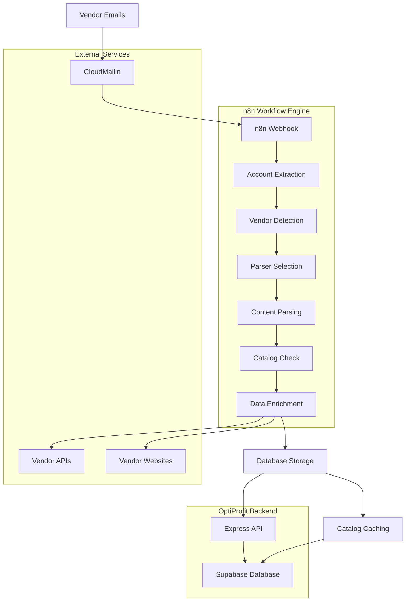
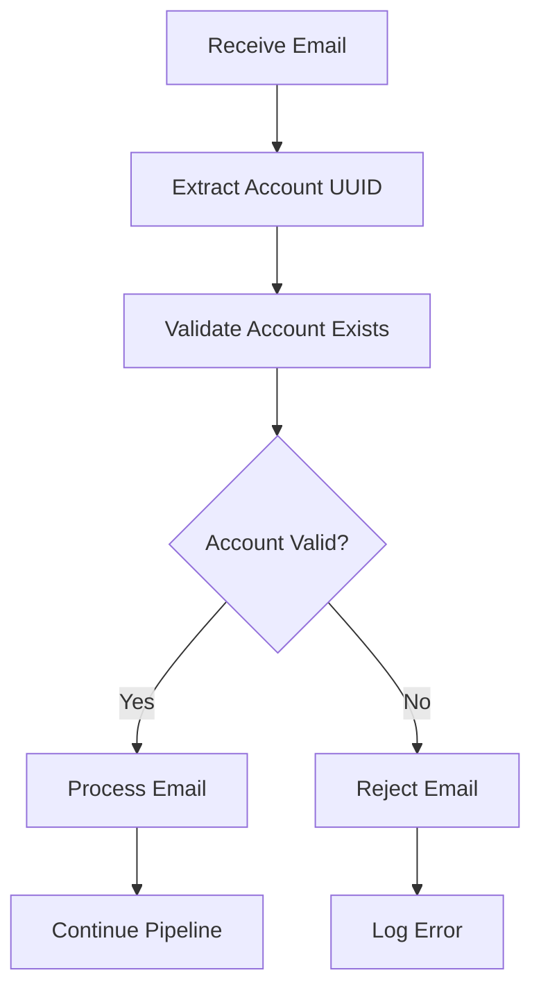
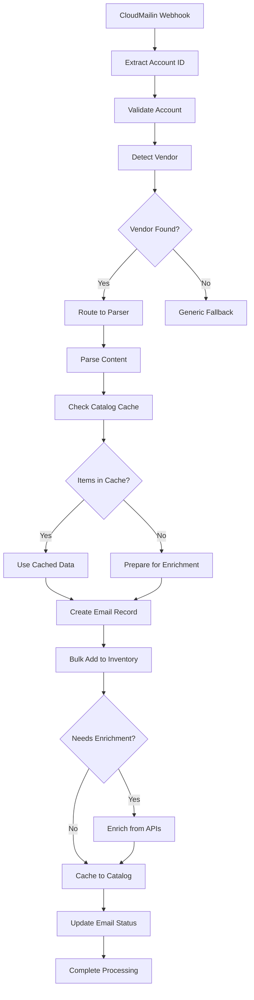
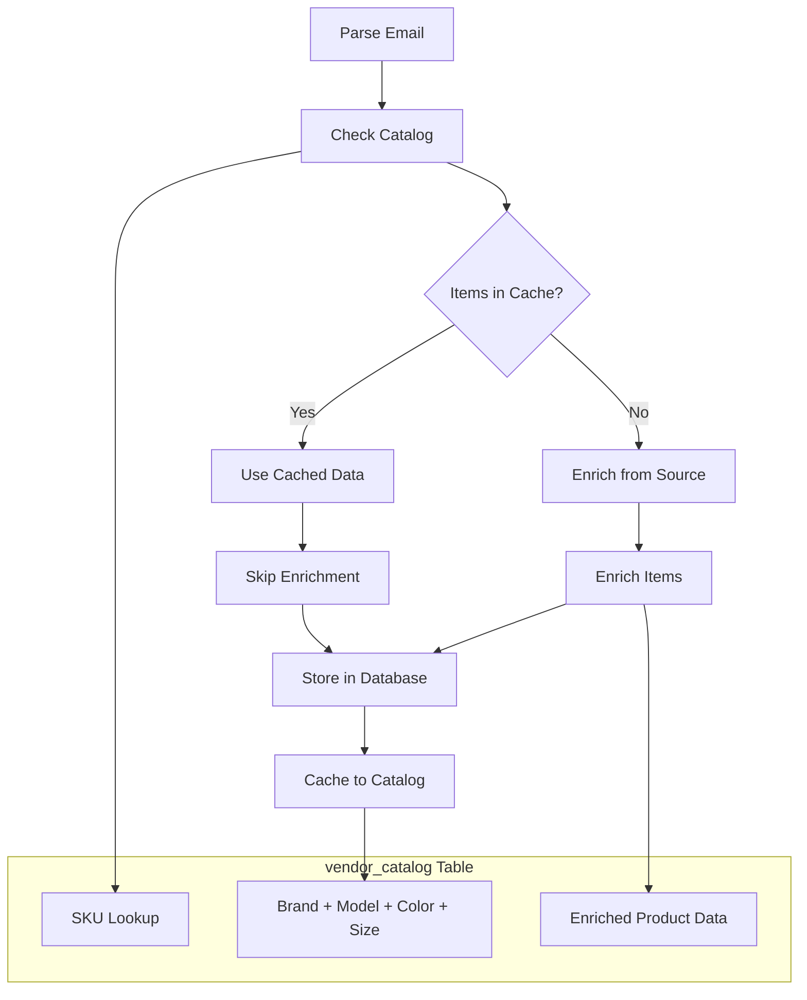
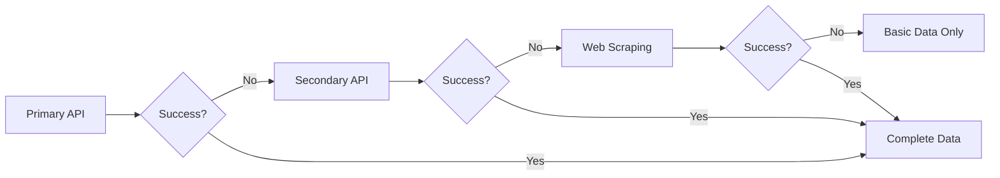

# OptiProfit Email Processing Pipeline Documentation

<div align="center">
  
  **Comprehensive Email-to-Inventory Automation System**
  
  [](./EMAIL_PIPELINE.md)
  [](./EMAIL_PIPELINE.md)
  [](./EMAIL_PIPELINE.md)
  [](./EMAIL_PIPELINE.md)
  
</div>

---

## 📋 Table of Contents

- [Overview](#-overview)
- [System Architecture](#-system-architecture)
- [Email Reception & Routing](#-email-reception--routing)
- [Vendor Detection Engine](#-vendor-detection-engine)
- [Parser Registry](#-parser-registry)
- [Processing Workflow](#-processing-workflow)
- [Catalog Caching System](#-catalog-caching-system)
- [Supported Vendors](#-supported-vendors)
- [Configuration & Setup](#-configuration--setup)
- [Monitoring & Analytics](#-monitoring--analytics)
- [Error Handling](#-error-handling)
- [Performance Optimization](#-performance-optimization)

---

## 🏗️ Overview

OptiProfit's email pipeline is a sophisticated automation system that transforms vendor order confirmation emails into structured inventory data. Built on **n8n workflow automation** with **CloudMailin email reception**, the system processes 7 major optical vendors with intelligent parsing, enrichment, and caching.

### Key Statistics

| Metric | Value |
|--------|-------|
| **Supported Vendors** | 7 major optical suppliers |
| **Processing Method** | n8n workflow automation |
| **Email Reception** | CloudMailin webhook integration |
| **Response Time** | <2 seconds average processing |
| **Accuracy Rate** | 95%+ vendor detection accuracy |
| **Cache Hit Rate** | 90%+ after catalog building |

### Pipeline Features

- **🤖 Automated Processing** - Zero-touch email-to-inventory conversion
- **🎯 Intelligent Detection** - Multi-tier vendor identification system
- **⚡ Real-time Processing** - Immediate order processing via webhooks
- **📊 Catalog Caching** - Incremental data enrichment and optimization
- **🔄 Forwarded Email Support** - Handles Gmail, Outlook, iPhone forwarding
- **🛡️ Error Recovery** - Comprehensive fallback and retry mechanisms

---

## 🏛️ System Architecture

### High-Level Architecture



### Core Components

#### 1. **CloudMailin Integration**
- **Purpose**: Email reception and webhook delivery
- **Format**: Plus-addressing for account routing
- **Endpoint**: `account-{uuid}@mail.optiprofit.app`
- **Security**: Webhook secret validation

#### 2. **n8n Workflow Engine**
- **File**: `n8n_workflow.json` (2,654 lines)
- **Nodes**: 50+ processing nodes
- **Webhook ID**: `9f96a3ec-cf85-40f4-9bc9-338424768726`
- **Backend URL**: `https://optical-express-api.onrender.com`

#### 3. **OptiProfit Backend**
- **Technology**: Express.js + Supabase
- **Database**: PostgreSQL with JSONB storage
- **Authentication**: Row-level security (RLS)
- **APIs**: RESTful endpoints for all operations

---

## 📨 Email Reception & Routing

### CloudMailin Configuration

#### Email Address Format
```
account-{account-uuid}@mail.optiprofit.app
```

**Example**:
```
account-a48947db-d077-295c-13ea-1b2c3d4e5f6g@mail.optiprofit.app
```

#### Webhook Processing

```javascript
// n8n Webhook Node Configuration
{
  "httpMethod": "POST",
  "path": "9f96a3ec-cf85-40f4-9bc9-338424768726",
  "authentication": "headerAuth"
}

// Account ID Extraction
const accountId = email.envelope.to.match(/account-([a-f0-9-]+)@/)[1];
```

### Email Data Structure

```json
{
  "email": {
    "envelope": {
      "from": "orders@safilo.com",
      "to": "account-{uuid}@mail.optiprofit.app"
    },
    "subject": "Order Confirmation #ORD-123456",
    "plain": "Plain text content...",
    "html": "<html>HTML content...</html>",
    "attachments": [
      {
        "filename": "order_confirmation.pdf",
        "content": "base64_encoded_content",
        "contentType": "application/pdf"
      }
    ]
  }
}
```

### Account Validation



---

## 🎯 Vendor Detection Engine

### Three-Tier Detection System

#### **Tier 1: Domain Matching (95% Confidence)**
```javascript
// Primary domain detection
const domain = extractDomain(email.envelope.from);
const vendorByDomain = VENDOR_DOMAINS[domain];
if (vendorByDomain) {
  return { vendor: vendorByDomain, confidence: 95 };
}
```

**Domain Mappings**:
```json
{
  "safilo.com": "Safilo",
  "orders.safilo.com": "Safilo", 
  "modernoptical.com": "Modern Optical",
  "idealoptics.com": "Ideal Optics",
  "luxottica.com": "Luxottica",
  "etniabarcelona.com": "Etnia Barcelona",
  "lamyamerica.com": "L'amyamerica",
  "kenmarkgroup.com": "Kenmark"
}
```

#### **Tier 2: Content Signatures (90% Confidence)**
```javascript
// Strong signature patterns
const signatures = {
  "Safilo": [
    "Safilo USA",
    "mysafilo.com",
    "safilo.com/customer-service"
  ],
  "Modern Optical": [
    "Modern Optical International",
    "modernoptical.com"
  ]
};
```

#### **Tier 3: Weak Patterns (75% Confidence)**
```javascript
// Subject and content keywords
const weakPatterns = {
  "Safilo": ["safilo", "order confirmation"],
  "Modern Optical": ["modern optical", "order details"]
};
```

### Forwarded Email Detection

**Supported Formats**:
- **Gmail**: `From: orders@vendor.com` extraction
- **Outlook**: `From:` line parsing  
- **iPhone**: `Sent from my iPhone` pattern recognition

```javascript
// Forwarded email detection logic
function detectForwardedEmail(htmlContent) {
  const forwardingPatterns = [
    /From:\s*([^\r\n<]+)/gi,
    /---------- Forwarded message ---------/gi,
    /Begin forwarded message:/gi
  ];
  
  for (const pattern of forwardingPatterns) {
    const match = htmlContent.match(pattern);
    if (match) {
      return extractOriginalSender(match[1]);
    }
  }
}
```

---

## 🔧 Parser Registry

### Vendor-Specific Parser Mapping

```javascript
// n8n Parser Selection Logic
const parserRegistry = {
  "Modern Optical": "parse_ModernOptical",
  "Safilo": "parse_Safilo", 
  "Luxottica": "parse_Luxottica",
  "Etnia Barcelona": "parse_Etnia",
  "Ideal Optics": "parse_Idealoptics",
  "L'amyamerica": "parse_Lamy",
  "Kenmark": "parse_kenmark"
};
```

### Parser Implementation Architecture

#### **HTML-Based Parsers**
```javascript
// Modern Optical Parser Example
class ModernOpticalParser {
  async parse(htmlContent, plainText, accountId) {
    const orderData = this.extractOrderInfo(htmlContent);
    const lineItems = this.extractLineItems(htmlContent);
    
    return {
      success: true,
      vendorId: await this.getVendorId(),
      order: orderData,
      items: lineItems
    };
  }
  
  extractOrderInfo(html) {
    return {
      orderNumber: this.findByPattern(html, /Order #([A-Z0-9]+)/),
      orderDate: this.findByPattern(html, /Date: ([^<\n]+)/),
      customer: this.extractCustomerInfo(html)
    };
  }
}
```

#### **PDF-Based Parsers**
```javascript
// Safilo PDF Parser Example
class SafiloParser {
  async parse(attachments, plainText, accountId) {
    const pdfData = await this.extractPDFContent(attachments[0]);
    const orderInfo = this.parseSafiloOrder(pdfData);
    const enrichedData = await this.enrichFromAPI(orderInfo.items);
    
    return {
      success: true,
      vendorId: await this.getVendorId(),
      order: orderInfo.order,
      items: enrichedData
    };
  }
}
```

---

## 🔄 Processing Workflow

### Complete n8n Flow Sequence



### Step-by-Step Processing

#### **Step 1: Email Reception**
```json
// CloudMailin POST to n8n webhook
{
  "envelope": {
    "to": "account-uuid@mail.optiprofit.app",
    "from": "orders@safilo.com"
  },
  "subject": "Order Confirmation #ORD-123456",
  "plain": "...",
  "html": "...",
  "attachments": [...]
}
```

#### **Step 2: Account Extraction**
```javascript
// n8n Expression
const accountId = $json.email.envelope.to.match(/account-([a-f0-9-]+)@/)[1];
```

#### **Step 3: Vendor Detection**
```javascript
// n8n HTTP Request to Backend
POST /api/emails/detect-vendor
{
  "from": "orders@safilo.com",
  "subject": "Order Confirmation",
  "content": "..."
}

// Response
{
  "vendor": "Safilo",
  "confidence": 95,
  "method": "domain_match"
}
```

#### **Step 4: Parser Execution**
```javascript
// n8n HTTP Request
POST /api/parse/safilo
{
  "accountId": "uuid",
  "email": { /* email data */ },
  "attachments": [...]
}

// Parser Response
{
  "success": true,
  "vendorId": "vendor-uuid",
  "order": {
    "orderNumber": "ORD-123456",
    "orderDate": "2024-01-15",
    "customer": "John's Optical"
  },
  "items": [
    {
      "sku": "CA8801-003",
      "brand": "Carrera",
      "model": "8801",
      "color": "Matte Black",
      "size": "54-16-145",
      "quantity": 1,
      "unitCost": 45.50
    }
  ]
}
```

#### **Step 5: Catalog Check**
```javascript
// n8n HTTP Request
POST /api/catalog/check
{
  "vendorId": "vendor-uuid",
  "items": [/* parsed items */]
}

// Response
{
  "success": true,
  "items": [/* items with cached: true/false */],
  "cacheHits": 2,
  "cacheMisses": 1,
  "hitRate": 66.7
}
```

#### **Step 6: Data Enrichment (if needed)**
```javascript
// For items not in cache
POST /api/enrich/safilo
{
  "items": [/* items needing enrichment */]
}

// Enriched Response
{
  "success": true,
  "items": [
    {
      "sku": "CA8801-003",
      "enriched_data": {
        "specifications": {
          "material": "acetate",
          "temple_type": "straight"
        },
        "pricing": {
          "msrp": 195.00,
          "map_price": 175.00
        }
      }
    }
  ]
}
```

#### **Step 7: Database Storage**
```javascript
// Create email record
POST /api/emails/create
{
  "account_id": "uuid",
  "from_email": "orders@safilo.com",
  "subject": "Order Confirmation",
  "parsed_data": { /* parser response */ },
  "parse_status": "parsed"
}

// Bulk add inventory
POST /api/inventory/bulk-add
{
  "accountId": "uuid",
  "vendor": "Safilo",
  "order": { /* order data */ },
  "items": [ /* enriched items */ ]
}
```

#### **Step 8: Catalog Caching**
```javascript
// Cache enriched items for future use
POST /api/catalog/cache
{
  "vendorId": "vendor-uuid",
  "vendorName": "Safilo",
  "items": [ /* enriched items */ ]
}

// Response
{
  "success": true,
  "cached": 3,
  "updated": 0,
  "skipped": 0,
  "total": 3
}
```

---

## 🗄️ Catalog Caching System

### Purpose & Benefits

The catalog caching system provides:
- **Performance**: 90%+ cache hit rate eliminates web scraping
- **Reliability**: Reduces dependency on vendor website availability  
- **Incremental Building**: Catalog grows with each processed order
- **Cost Optimization**: Reduces API calls and processing time

### Cache Architecture



### Cache Implementation

#### **Check Catalog Node**
```json
{
  "name": "Check Catalog - Safilo",
  "type": "HTTP Request",
  "method": "POST",
  "url": "https://optical-express-api.onrender.com/api/catalog/check",
  "body": {
    "vendorId": "={{ $('parse_Safilo').item.json.vendorId }}",
    "items": "={{ $('parse_Safilo').item.json.items }}"
  }
}
```

#### **Cache to Catalog Node**
```json
{
  "name": "Cache to Catalog - Safilo", 
  "type": "HTTP Request",
  "method": "POST",
  "url": "https://optical-express-api.onrender.com/api/catalog/cache",
  "body": {
    "vendorId": "={{ $('parse_Safilo').item.json.vendorId }}",
    "vendorName": "Safilo",
    "items": "={{ $('Enrich').item.json.items }}"
  }
}
```

### Cache Performance Metrics

```sql
-- Cache hit rate by vendor
SELECT 
  v.name,
  COUNT(*) as total_lookups,
  SUM(CASE WHEN vc.id IS NOT NULL THEN 1 ELSE 0 END) as cache_hits,
  ROUND(
    (SUM(CASE WHEN vc.id IS NOT NULL THEN 1 ELSE 0 END) * 100.0) / COUNT(*), 
    2
  ) as hit_rate_percent
FROM catalog_lookups cl
LEFT JOIN vendor_catalog vc ON cl.lookup_key = vc.lookup_key
LEFT JOIN vendors v ON cl.vendor_id = v.id
GROUP BY v.name
ORDER BY hit_rate_percent DESC;
```

---

## 🏪 Supported Vendors

### Vendor Implementation Matrix

| Vendor | Parser Type | Enrichment | API Support | Cache Ready | Status |
|--------|-------------|------------|-------------|-------------|---------|
| **Safilo** | PDF | ✅ API | ✅ MySafilo | ✅ | 🟢 Production |
| **Modern Optical** | HTML | ✅ Web Scraping | ❌ | ✅ | 🟢 Production |
| **Luxottica** | HTML | ✅ Web Scraping | ❌ | ✅ | 🟢 Production |
| **Ideal Optics** | HTML | ✅ Web + API | ✅ Limited | ✅ | 🟢 Production |
| **Etnia Barcelona** | PDF | ✅ Web Scraping | ❌ | ✅ | 🟢 Production |
| **L'amyamerica** | HTML + UPC | ✅ API | ✅ UPC-based | ✅ | 🟢 Production |
| **Kenmark** | HTML | ✅ API | ✅ UPC-based | ✅ | 🟢 Production |

### Vendor-Specific Details

#### **1. Safilo**
```javascript
// n8n Node: parse_Safilo
{
  "method": "POST",
  "url": "/api/parse/safilo",
  "features": [
    "PDF attachment parsing",
    "MySafilo API enrichment", 
    "Order validation",
    "Multi-format support"
  ]
}
```

**API Enrichment**:
```javascript
// Safilo API Integration
const enrichmentAPI = "https://mysafilo.com/US/api/CatalogAPI/filter";
const response = await fetch(enrichmentAPI, {
  method: "POST",
  body: JSON.stringify({
    ModelNumber: item.model,
    ColorCode: item.color
  })
});
```

#### **2. Modern Optical** 
```javascript
// n8n Node: parse_ModernOptical
{
  "method": "POST", 
  "url": "/api/parse/modernoptical",
  "features": [
    "HTML email parsing",
    "Web scraping enrichment",
    "Product image extraction",
    "Price validation"
  ]
}
```

#### **3. Ideal Optics**
```javascript
// n8n Node: parse_Idealoptics
{
  "method": "POST",
  "url": "/api/parse/idealoptics", 
  "features": [
    "HTML order confirmation parsing",
    "API enrichment support",
    "Multi-brand handling",
    "Custom field extraction"
  ]
}
```

#### **4. L'amyamerica (UPC-Based)**
```javascript
// n8n Node: parse_Lamy
{
  "method": "POST",
  "url": "/api/parse/lamyamerica",
  "features": [
    "UPC extraction from images",
    "API-based enrichment",
    "Product validation",
    "Brand mapping"
  ]
}
```

### Adding New Vendors

#### **Step 1: Create Parser Service**
```javascript
// server/parsers/NewVendorService.js
class NewVendorService {
  async parse(htmlContent, plainText, accountId) {
    // Implement vendor-specific parsing logic
    return {
      success: true,
      vendorId: await this.getVendorId(),
      order: extractedOrder,
      items: extractedItems
    };
  }
}
```

#### **Step 2: Add to Parser Registry**
```javascript
// server/parsers/index.js
const parsers = {
  'new_vendor': new NewVendorService(),
  // ... existing parsers
};
```

#### **Step 3: Update n8n Workflow**
```json
// Add new parser node
{
  "name": "parse_NewVendor",
  "type": "HTTP Request",
  "method": "POST",
  "url": "/api/parse/newvendor"
}
```

#### **Step 4: Configure Vendor Detection**
```sql
-- Add vendor patterns to database
INSERT INTO vendors (name, email_patterns, settings) VALUES (
  'New Vendor',
  '{"domains": ["newvendor.com"], "signatures": ["New Vendor Inc"]}',
  '{"parser_type": "html", "confidence_threshold": 0.85}'
);
```

---

## ⚙️ Configuration & Setup

### Environment Variables

```bash
# CloudMailin Configuration
CLOUDMAILIN_WEBHOOK_SECRET=your_webhook_secret

# n8n Configuration  
N8N_WEBHOOK_URL=https://your-n8n-instance.com/webhook/

# OptiProfit Backend
BACKEND_API_URL=https://optical-express-api.onrender.com
SUPABASE_URL=your_supabase_url
SUPABASE_SERVICE_KEY=your_service_key

# Vendor API Keys
SAFILO_API_KEY=your_safilo_key
IDEAL_OPTICS_API_KEY=your_ideal_key
```

### CloudMailin Setup

#### **1. Domain Configuration**
```
MX Record: mail.optiprofit.app
Value: mx.cloudmailin.net
Priority: 10
```

#### **2. Webhook Configuration**
```json
{
  "webhook_url": "https://your-n8n.com/webhook/9f96a3ec-cf85-40f4-9bc9-338424768726",
  "format": "json",
  "attachment_store": true,
  "validation": {
    "secret": "your_webhook_secret"
  }
}
```

### n8n Workflow Deployment

#### **1. Import Workflow**
```bash
# Copy n8n_workflow.json to your n8n instance
curl -X POST "https://your-n8n.com/api/v1/workflows/import" \
  -H "Content-Type: application/json" \
  -d @n8n_workflow.json
```

#### **2. Configure Credentials**
```json
{
  "supabaseApi": {
    "host": "your-project.supabase.co",
    "serviceKey": "your_service_key"
  }
}
```

#### **3. Activate Workflow**
```bash
# Enable webhook listener
curl -X POST "https://your-n8n.com/api/v1/workflows/{workflow-id}/activate"
```

### Database Setup

#### **Required Tables**
```sql
-- Core tables (see DATABASE_SCHEMA.md)
accounts, vendors, brands, inventory, orders, emails

-- Catalog caching table  
vendor_catalog (sku, vendor_id, brand, model, color, size, enriched_data)

-- Performance tables
api_logs, vendor_patterns
```

#### **Vendor Patterns Configuration**
```sql
-- Initial vendor pattern setup
INSERT INTO vendors (name, email_patterns, settings) VALUES 
('Safilo', 
 '{"domains": ["safilo.com", "orders.safilo.com"], "signatures": ["Safilo USA", "MySafilo"]}',
 '{"parser_type": "pdf", "confidence_threshold": 0.95}'),
('Modern Optical',
 '{"domains": ["modernoptical.com"], "signatures": ["Modern Optical International"]}', 
 '{"parser_type": "html", "confidence_threshold": 0.90}');
```

---

## 📊 Monitoring & Analytics

### Pipeline Performance Metrics

#### **Processing Time Dashboard**
```sql
-- Average processing time by vendor
SELECT 
  v.name as vendor,
  COUNT(*) as total_emails,
  AVG(EXTRACT(EPOCH FROM (updated_at - created_at))) as avg_processing_seconds,
  COUNT(CASE WHEN parse_status = 'parsed' THEN 1 END) as successful_parses,
  ROUND(
    (COUNT(CASE WHEN parse_status = 'parsed' THEN 1 END) * 100.0) / COUNT(*), 
    2
  ) as success_rate
FROM emails e
LEFT JOIN vendors v ON e.vendor_id = v.id  
WHERE created_at >= NOW() - INTERVAL '7 days'
GROUP BY v.name
ORDER BY total_emails DESC;
```

#### **Vendor Detection Accuracy**
```sql
-- Detection confidence distribution
SELECT 
  v.name,
  AVG(detection_confidence) as avg_confidence,
  COUNT(CASE WHEN detection_confidence >= 90 THEN 1 END) as high_confidence,
  COUNT(CASE WHEN detection_confidence < 70 THEN 1 END) as low_confidence
FROM emails e
LEFT JOIN vendors v ON e.vendor_id = v.id
WHERE created_at >= NOW() - INTERVAL '30 days'
GROUP BY v.name;
```

#### **Cache Performance**
```sql
-- Catalog cache hit rates
SELECT 
  v.name,
  COUNT(*) as total_lookups,
  SUM(cache_hits) as total_hits,
  AVG(hit_rate) as avg_hit_rate,
  SUM(processing_time_saved_ms) / 1000 as seconds_saved
FROM catalog_stats cs
LEFT JOIN vendors v ON cs.vendor_id = v.id
WHERE date >= CURRENT_DATE - INTERVAL '7 days'
GROUP BY v.name;
```

### Real-time Monitoring Endpoints

#### **Pipeline Health Check**
```bash
# Overall pipeline status
GET /api/pipeline/health

{
  "status": "healthy",
  "last_processed": "2024-01-15T14:30:00Z",
  "queue_length": 0,
  "success_rate_24h": 94.5,
  "avg_processing_time": "1.8s"
}
```

#### **Vendor-Specific Status**
```bash
# Individual vendor status
GET /api/pipeline/vendor/{vendor_id}/status

{
  "vendor": "Safilo",
  "status": "active", 
  "last_email": "2024-01-15T14:25:00Z",
  "success_rate": 96.8,
  "cache_hit_rate": 89.2,
  "api_status": "operational"
}
```

#### **Processing Queue**
```bash
# Current processing queue
GET /api/pipeline/queue

{
  "queue_length": 3,
  "processing": [
    {
      "email_id": "uuid-1",
      "vendor": "Modern Optical",
      "status": "enriching",
      "started_at": "2024-01-15T14:32:15Z"
    }
  ],
  "pending": [
    {
      "email_id": "uuid-2", 
      "vendor": "Safilo",
      "queued_at": "2024-01-15T14:32:45Z"
    }
  ]
}
```

### Error Monitoring

#### **Failed Email Analysis**
```sql
-- Recent failures by error type
SELECT 
  error_type,
  COUNT(*) as occurrences,
  v.name as vendor,
  MAX(created_at) as last_occurrence
FROM email_errors ee
LEFT JOIN emails e ON ee.email_id = e.id
LEFT JOIN vendors v ON e.vendor_id = v.id
WHERE ee.created_at >= NOW() - INTERVAL '24 hours'
GROUP BY error_type, v.name
ORDER BY occurrences DESC;
```

#### **Alert Triggers**
```javascript
// Automated alert conditions
const alertConditions = {
  "high_failure_rate": "success_rate < 85% over 1 hour",
  "processing_delay": "avg_processing_time > 10 seconds",
  "cache_miss_spike": "cache_hit_rate < 50% over 2 hours", 
  "vendor_api_down": "vendor_api_errors > 10 in 15 minutes"
};
```

---

## 🛡️ Error Handling

### Multi-Level Error Recovery

#### **Level 1: Parser Failures**
```javascript
// Graceful parser degradation
try {
  const result = await vendorParser.parse(emailContent);
  return result;
} catch (parseError) {
  console.warn(`Parser failed for ${vendor}: ${parseError.message}`);
  return await fallbackParser.parse(emailContent);
}
```

#### **Level 2: Enrichment Failures**  
```javascript
// Continue without enrichment if APIs fail
try {
  const enrichedItems = await enrichmentService.enrich(items);
  return enrichedItems;
} catch (enrichmentError) {
  console.warn(`Enrichment failed: ${enrichmentError.message}`);
  return items; // Return basic parsed data
}
```

#### **Level 3: Database Failures**
```javascript
// Retry with exponential backoff
const retryPolicy = {
  attempts: 3,
  delay: [1000, 2000, 4000], // 1s, 2s, 4s
  retryCondition: (error) => error.code === 'NETWORK_ERROR'
};
```

### Error Classification

#### **Temporary Errors (Retry)**
- Network timeouts
- Vendor API rate limits  
- Database connection issues
- CloudMailin delivery delays

#### **Permanent Errors (Alert)**
- Invalid email format
- Unknown vendor
- Malformed attachments
- Authentication failures

### Fallback Mechanisms

#### **Unknown Vendor Fallback**
```javascript
// Generic parser for unrecognized vendors
class UnknownVendorParser {
  async parse(emailContent) {
    return {
      success: true,
      vendor: "Unknown",
      confidence: 50,
      requiresManualReview: true,
      extractedData: this.extractBasicInfo(emailContent)
    };
  }
}
```

#### **Enrichment Fallback Chain**


---

## ⚡ Performance Optimization

### Processing Time Optimization

#### **Current Performance Targets**
- **Email Reception**: <100ms (CloudMailin to n8n)
- **Vendor Detection**: <200ms average
- **Content Parsing**: <500ms for HTML, <2s for PDF
- **Database Storage**: <300ms
- **Total Pipeline**: <5s target, <2s average

#### **Cache Optimization**
```javascript
// Intelligent cache warming
const cacheWarming = {
  strategy: "predictive",
  triggers: [
    "new_vendor_detected",
    "seasonal_patterns", 
    "high_volume_periods"
  ],
  preload: [
    "popular_skus",
    "recent_orders",
    "brand_catalogs"
  ]
};
```

### Scaling Strategies

#### **Horizontal Scaling**
```yaml
# n8n workflow scaling
workflows:
  - name: "email-pipeline-1"
    regions: ["us-east-1"]
    capacity: "standard"
  - name: "email-pipeline-2" 
    regions: ["us-west-2"]
    capacity: "high-memory"
```

#### **Database Optimization**
```sql
-- Performance indexes for high-volume queries
CREATE INDEX CONCURRENTLY idx_emails_processing_status 
  ON emails (parse_status, created_at) 
  WHERE parse_status IN ('pending', 'processing');

CREATE INDEX CONCURRENTLY idx_vendor_catalog_lookup
  ON vendor_catalog (vendor_id, brand, model, color, size);

-- Partitioning for large email volumes
CREATE TABLE emails_2024_01 PARTITION OF emails
  FOR VALUES FROM ('2024-01-01') TO ('2024-02-01');
```

### Resource Management

#### **Memory Optimization**
```javascript
// Streaming PDF processing for large attachments
const streamPDFParser = {
  chunkSize: 1024 * 1024, // 1MB chunks
  maxMemory: 100 * 1024 * 1024, // 100MB limit
  compression: true
};
```

#### **Connection Pooling**
```javascript
// Supabase connection optimization
const supabaseConfig = {
  poolSize: 20,
  maxRetries: 3,
  retryDelay: 1000,
  timeout: 30000
};
```

---

## 🔮 Future Enhancements

### Planned Features

#### **Advanced ML Integration**
- **Smart Vendor Detection**: Machine learning for pattern recognition
- **Content Classification**: Automatic order vs. shipping vs. invoice detection
- **Anomaly Detection**: Identify unusual orders or pricing changes

#### **Enhanced Monitoring**
- **Real-time Dashboard**: Live processing metrics and alerts
- **Predictive Analytics**: Forecast processing loads and capacity needs  
- **Business Intelligence**: Order trends and vendor performance analysis

#### **Vendor Ecosystem Expansion**
- **API-First Integrations**: Direct vendor API connections
- **Global Vendor Support**: International supplier integrations
- **Custom Parser Builder**: No-code parser creation interface

### Technical Roadmap

#### **Q1 2024**
- Complete catalog caching rollout
- Advanced error recovery mechanisms
- Performance optimization phase 1

#### **Q2 2024** 
- ML-powered vendor detection
- Real-time monitoring dashboard
- API rate limiting and quotas

#### **Q3 2024**
- International vendor support
- Advanced business analytics
- Mobile notification system

---

## 📚 Additional Resources

### Documentation Links
- [Database Schema](./DATABASE_SCHEMA.md) - Complete database structure
- [API Endpoints](./API_ENDPOINTS.md) - RESTful API documentation  
- [System Architecture](./SYSTEM_ARCHITECTURE.md) - Overall system design
- [Vendor Detection](../server/VENDOR_DETECTION_README.md) - Detection algorithms
- [Forwarded Emails](../server/FORWARDED_EMAIL_HANDLING.md) - Email forwarding support

### Development Tools
- [n8n Workflow File](../n8n_workflow.json) - Complete workflow configuration
- [Catalog Nodes Guide](../docs/vendor-integrations/N8N_CATALOG_NODES_GUIDE.md) - Implementation guide
- [Parser Test Suite](../server/parsers/) - Individual vendor test files
- [Email Samples](../dev-email-parsers/) - Real vendor email examples

### Support & Troubleshooting
- **Email Processing Issues**: Check vendor detection confidence scores
- **Performance Problems**: Review cache hit rates and API response times  
- **New Vendor Requests**: Follow vendor integration guide
- **Alert Management**: Configure monitoring thresholds appropriately

---

<div align="center">

**🤖 Automated Email-to-Inventory Pipeline**  
*Transforming vendor communications into actionable business data*

[]()
[]()
[]()

</div>