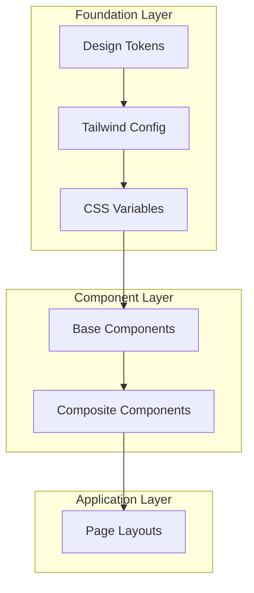

# OptiProfit Design System & Style Guide

<div align="center">
  
  **Comprehensive Design System Documentation**
  
  [](./STYLE_GUIDE.md)
  [](./STYLE_GUIDE.md)
  [](./STYLE_GUIDE.md)
  [](./STYLE_GUIDE.md)
  
</div>

---

## 📋 Table of Contents

- [Overview](#-overview)
- [Design Philosophy](#-design-philosophy)
- [Typography](#-typography)
- [Color System](#-color-system)
- [Spacing & Layout](#-spacing--layout)
- [Components](#-components)
- [Animations & Motion](#-animations--motion)
- [Responsive Design](#-responsive-design)
- [Icons & Imagery](#-icons--imagery)
- [Implementation Guidelines](#-implementation-guidelines)
- [Development Workflow](#-development-workflow)

---

## 🎨 Overview

OptiProfit's design system is built on **modern web standards** with a focus on **accessibility**, **performance**, and **developer experience**. The system leverages **utility-first CSS** through Tailwind CSS, **component abstraction** via shadcn/ui, and **smooth animations** with Framer Motion.

### Design System Architecture



### Key Technologies

| Technology | Version | Purpose |
|------------|---------|---------|
| **Tailwind CSS** | 3.4.1 | Utility-first CSS framework |
| **shadcn/ui** | Latest | Component library ("new-york" style) |
| **Framer Motion** | Latest | Animation and motion library |
| **CSS Variables** | Native | Dynamic theming with HSL values |
| **Inter Font** | Google Fonts | Primary typography |
| **Lucide Icons** | Latest | Consistent icon system |

---

## 🧠 Design Philosophy

### Core Principles

#### **1. Accessibility First**
- **WCAG 2.1 AA compliance** across all components
- **High contrast ratios** (minimum 4.5:1 for normal text)
- **Keyboard navigation** support for all interactive elements
- **Screen reader optimization** with semantic HTML and ARIA labels

#### **2. Performance Focused**
- **Minimal bundle size** through tree-shaking and utility CSS
- **60fps animations** with hardware acceleration
- **Efficient re-renders** using React best practices
- **Optimized font loading** with preload hints

#### **3. Developer Experience**
- **Type-safe components** with TypeScript
- **Consistent API patterns** across all components
- **Comprehensive documentation** with examples
- **Hot reload support** for rapid development

#### **4. Scalable Architecture**
- **Design token system** for consistent theming
- **Component composition** over inheritance
- **Responsive by default** approach
- **Dark mode support** throughout

---

## ✍️ Typography

### Font Stack

#### **Primary Font Family**
```css
font-family: 'Inter', -apple-system, BlinkMacSystemFont, 'Segoe UI', Roboto, Oxygen, Ubuntu, Cantarell, sans-serif;
```

#### **Heading Font Family**
```css
font-family: 'Cal Sans', 'Inter', -apple-system, BlinkMacSystemFont, 'Segoe UI', Roboto, sans-serif;
```

#### **Font Features**
```css
font-feature-settings: "rlig" 1, "calt" 1;
```
- **Contextual Alternates** (`calt`): Improved character spacing and ligatures
- **Required Ligatures** (`rlig`): Essential ligatures for readability

### Typography Scale

| Class | Size | Line Height | Usage |
|-------|------|-------------|-------|
| `text-xs` | 12px | 16px | Captions, helper text |
| `text-sm` | 14px | 20px | Body text (small), labels |
| `text-base` | 16px | 24px | Body text (default) |
| `text-lg` | 18px | 28px | Subtitle, large body text |
| `text-xl` | 20px | 28px | Small headings |
| `text-2xl` | 24px | 32px | Medium headings |
| `text-3xl` | 30px | 36px | Large headings |
| `text-4xl` | 36px | 40px | Display headings |

### Font Weights

| Class | Weight | Usage |
|-------|---------|-------|
| `font-normal` | 400 | Body text |
| `font-medium` | 500 | Emphasized text, labels |
| `font-semibold` | 600 | Subheadings, important text |
| `font-bold` | 700 | Headings, strong emphasis |

### Typography Examples

```tsx
// Page heading
<h1 className="text-3xl font-bold text-foreground">
  Inventory Management
</h1>

// Section heading
<h2 className="text-xl font-semibold text-foreground mb-4">
  Current Inventory
</h2>

// Body text
<p className="text-base text-muted-foreground leading-relaxed">
  Manage your frame inventory with automated order processing and real-time tracking.
</p>

// Caption text
<span className="text-xs text-muted-foreground uppercase tracking-wide">
  Last updated 2 hours ago
</span>
```

### Typography Best Practices

#### **Hierarchy**
- Use consistent heading levels (h1 → h2 → h3)
- Maintain visual hierarchy with size and weight
- Limit heading levels to 3-4 for clarity

#### **Readability**
- **Line length**: 45-75 characters for optimal reading
- **Line height**: 1.5x for body text, 1.2x for headings
- **Letter spacing**: Default, except for all-caps text (+0.05em)

#### **Accessibility**
- **Minimum contrast**: 4.5:1 for normal text, 3:1 for large text
- **Focus indicators**: Visible outline for keyboard navigation
- **Text scaling**: Support up to 200% zoom without horizontal scrolling

---

## 🎨 Color System

### Color Architecture

OptiProfit uses **HSL-based CSS variables** for dynamic theming with automatic light/dark mode support.

### Primary Color Palette

#### **Light Theme**
```css
:root {
  --background: 0 0% 100%;          /* Pure white */
  --foreground: 222.2 84% 4.9%;     /* Very dark blue-gray */
  --primary: 221.2 83.2% 53.3%;     /* Vibrant blue */
  --primary-foreground: 210 40% 98%; /* Nearly white */
  --muted: 210 40% 96.1%;           /* Light gray */
  --muted-foreground: 215.4 16.3% 46.9%; /* Medium gray */
}
```

#### **Dark Theme**
```css
.dark {
  --background: 222.2 84% 4.9%;     /* Very dark */
  --foreground: 210 40% 98%;        /* Nearly white */
  --primary: 217.2 91.2% 59.8%;     /* Brighter blue */
  --primary-foreground: 222.2 47.4% 11.2%; /* Dark */
  --muted: 217.2 32.6% 17.5%;       /* Dark gray */
  --muted-foreground: 215 20.2% 65.1%; /* Light gray */
}
```

### Brand Colors

#### **Primary Blue Palette**
| Usage | Class | Hex | HSL |
|-------|-------|-----|-----|
| Primary | `bg-blue-600` | #2563eb | 221° 83% 53% |
| Primary Hover | `bg-blue-700` | #1d4ed8 | 225° 83% 48% |
| Primary Light | `bg-blue-50` | #eff6ff | 214° 100% 97% |
| Primary Border | `border-blue-200` | #bfdbfe | 214° 95% 93% |

#### **Secondary Purple Palette**
| Usage | Class | Hex | HSL |
|-------|-------|-----|-----|
| Secondary | `bg-purple-600` | #9333ea | 271° 81% 56% |
| Secondary Hover | `bg-purple-700` | #7c3aed | 271° 76% 53% |
| Secondary Light | `bg-purple-50` | #faf5ff | 270° 100% 98% |

#### **Neutral Gray Palette**
| Usage | Class | Hex | HSL |
|-------|-------|-----|-----|
| Background | `bg-gray-50` | #f9fafb | 220° 14% 98% |
| Border | `border-gray-200` | #e5e7eb | 220° 13% 91% |
| Text Secondary | `text-gray-600` | #4b5563 | 220° 9% 46% |
| Text Primary | `text-gray-900` | #111827 | 220° 39% 11% |

### Status Colors

#### **Success (Green)**
```css
/* Success states, positive actions */
--success: 142 76% 36%;           /* #16a34a */
--success-foreground: 138 76% 97%; /* #f0fdf4 */
```

#### **Warning (Orange)**
```css
/* Warning states, attention needed */
--warning: 31 81% 56%;            /* #ea580c */
--warning-foreground: 33 100% 96%; /* #fffbeb */
```

#### **Error (Red)**
```css
/* Error states, destructive actions */
--destructive: 0 84% 60%;         /* #ef4444 */
--destructive-foreground: 0 86% 97%; /* #fef2f2 */
```

### Color Usage Guidelines

#### **Interactive Elements**
```tsx
// Primary actions
<Button className="bg-primary text-primary-foreground hover:bg-primary/90">
  Save Changes
</Button>

// Secondary actions
<Button variant="outline" className="border-border bg-background hover:bg-accent">
  Cancel
</Button>

// Destructive actions
<Button variant="destructive" className="bg-destructive text-destructive-foreground">
  Delete Item
</Button>
```

#### **Status Indicators**
```tsx
// Success state
<Badge className="bg-emerald-100 text-emerald-800 border-emerald-200">
  In Stock
</Badge>

// Warning state
<Badge className="bg-orange-100 text-orange-800 border-orange-200">
  Low Stock
</Badge>

// Error state
<Badge className="bg-red-100 text-red-800 border-red-200">
  Out of Stock
</Badge>
```

### Color Accessibility

#### **Contrast Ratios**
- **Normal text**: Minimum 4.5:1 contrast ratio
- **Large text** (18px+ or 14px+ bold): Minimum 3:1 contrast ratio
- **Interactive elements**: Minimum 3:1 contrast ratio
- **Focus indicators**: Minimum 3:1 contrast ratio

#### **Color Blindness Support**
- Never rely on color alone to convey information
- Use icons, patterns, or text labels alongside color
- Test with color blindness simulators
- Provide high contrast mode option

---

## 📐 Spacing & Layout

### Spacing Scale

OptiProfit uses **Tailwind's 0.25rem (4px) base unit** for consistent spacing:

| Class | Value | Pixels | Usage |
|-------|-------|---------|--------|
| `0` | 0 | 0px | No spacing |
| `px` | 1px | 1px | Borders, fine lines |
| `0.5` | 0.125rem | 2px | Very tight spacing |
| `1` | 0.25rem | 4px | Minimal spacing |
| `2` | 0.5rem | 8px | Small spacing |
| `3` | 0.75rem | 12px | Default spacing |
| `4` | 1rem | 16px | Medium spacing |
| `6` | 1.5rem | 24px | Large spacing |
| `8` | 2rem | 32px | Extra large spacing |
| `12` | 3rem | 48px | Section spacing |
| `16` | 4rem | 64px | Page spacing |

### Layout System

#### **Container System**
```css
.container {
  width: 100%;
  margin: 0 auto;
  padding: 2rem;
  max-width: 1400px; /* 2xl breakpoint */
}
```

#### **Grid System**
```tsx
// 12-column grid
<div className="grid grid-cols-12 gap-6">
  <div className="col-span-12 md:col-span-8">Main content</div>
  <div className="col-span-12 md:col-span-4">Sidebar</div>
</div>

// Auto-fit grid
<div className="grid grid-cols-1 md:grid-cols-2 lg:grid-cols-3 gap-6">
  {items.map(item => <Card key={item.id} />)}
</div>
```

#### **Flexbox Patterns**
```tsx
// Header with title and actions
<div className="flex items-center justify-between">
  <h1 className="text-2xl font-bold">Page Title</h1>
  <div className="flex gap-3">
    <Button variant="outline">Cancel</Button>
    <Button>Save</Button>
  </div>
</div>

// Vertical stack with consistent spacing
<div className="space-y-6">
  <Section />
  <Section />
  <Section />
</div>
```

### Layout Components

#### **Page Layout**
```tsx
function PageLayout({ children, title, actions }) {
  return (
    <div className="space-y-6 p-6 bg-gray-50 min-h-screen">
      <div className="flex items-center justify-between">
        <h1 className="text-2xl font-bold text-gray-900">{title}</h1>
        {actions && <div className="flex gap-3">{actions}</div>}
      </div>
      <div className="space-y-6">{children}</div>
    </div>
  );
}
```

#### **Card Layout**
```tsx
function Card({ children, title, className }) {
  return (
    <div className={cn("bg-white rounded-lg border border-gray-200 shadow-sm", className)}>
      {title && (
        <div className="px-6 py-4 border-b border-gray-200">
          <h3 className="text-lg font-semibold text-gray-900">{title}</h3>
        </div>
      )}
      <div className="p-6">{children}</div>
    </div>
  );
}
```

### Responsive Breakpoints

| Breakpoint | Min Width | Usage |
|------------|-----------|--------|
| `sm` | 640px | Large mobile |
| `md` | 768px | Tablet |
| `lg` | 1024px | Desktop |
| `xl` | 1280px | Large desktop |
| `2xl` | 1400px | Extra large desktop |

---

## 🧩 Components

### Component Architecture

OptiProfit follows **composition over inheritance** with reusable, accessible components.

### Button Component

#### **Variants**
```tsx
// Default button
<Button variant="default">Default Action</Button>

// Primary button (call-to-action)
<Button variant="primary">Save Changes</Button>

// Outline button (secondary action)
<Button variant="outline">Cancel</Button>

// Ghost button (subtle action)
<Button variant="ghost">More Options</Button>

// Link button (navigation)
<Button variant="link">Learn More</Button>
```

#### **Sizes**
```tsx
<Button size="sm">Small Button</Button>   // 32px height
<Button size="md">Medium Button</Button> // 40px height (default)
<Button size="lg">Large Button</Button>  // 48px height
```

#### **States**
```tsx
// Loading state
<Button isLoading>Saving...</Button>

// Disabled state
<Button disabled>Unavailable</Button>

// With icon
<Button icon={<Plus />} iconPosition="left">Add Item</Button>
```

### Badge Component

#### **Variants**
```tsx
// Status indicators
<Badge variant="default">Active</Badge>
<Badge variant="secondary">Pending</Badge>
<Badge variant="destructive">Error</Badge>
<Badge variant="outline">Draft</Badge>
```

### Card Component

#### **Variants**
```tsx
// Basic card
<Card>
  <CardHeader>
    <CardTitle>Inventory Status</CardTitle>
  </CardHeader>
  <CardContent>
    <p>Current items in stock: 1,247</p>
  </CardContent>
</Card>

// Elevated card
<Card variant="elevated" className="shadow-lg">
  <CardContent>Important information</CardContent>
</Card>
```

### Form Components

#### **Input Fields**
```tsx
// Text input
<Input 
  type="text"
  placeholder="Enter SKU"
  className="focus-ring"
/>

// Select dropdown
<Select>
  <SelectTrigger>
    <SelectValue placeholder="Select vendor" />
  </SelectTrigger>
  <SelectContent>
    <SelectItem value="safilo">Safilo</SelectItem>
    <SelectItem value="luxottica">Luxottica</SelectItem>
  </SelectContent>
</Select>

// Checkbox
<Checkbox 
  id="terms"
  checked={agreed}
  onCheckedChange={setAgreed}
/>
<Label htmlFor="terms">I agree to the terms</Label>
```

### Modal Components

#### **Dialog Modal**
```tsx
<Dialog open={isOpen} onOpenChange={setIsOpen}>
  <DialogContent className="sm:max-w-lg">
    <DialogHeader>
      <DialogTitle>Confirm Action</DialogTitle>
      <DialogDescription>
        This action cannot be undone.
      </DialogDescription>
    </DialogHeader>
    <DialogFooter>
      <Button variant="outline" onClick={() => setIsOpen(false)}>
        Cancel
      </Button>
      <Button variant="destructive" onClick={handleConfirm}>
        Delete
      </Button>
    </DialogFooter>
  </DialogContent>
</Dialog>
```

### Component Best Practices

#### **1. Accessibility**
- Use semantic HTML elements
- Provide ARIA labels and descriptions
- Ensure keyboard navigation works
- Support screen readers

#### **2. Performance**
- Use React.memo for expensive components
- Implement proper key props for lists
- Avoid inline styles and functions
- Use CSS for animations when possible

#### **3. Composition**
- Build complex components from simple ones
- Use render props or hooks for logic sharing
- Keep components focused and single-purpose
- Prefer composition over prop drilling

---

## 🎬 Animations & Motion

### Animation Philosophy

OptiProfit uses **subtle, purposeful animations** that enhance user experience without being distracting.

### Framer Motion Integration

#### **Button Animations**
```tsx
const buttonAnimation: Variants = {
  hover: {
    scale: 1.03,
    transition: {
      type: 'spring',
      stiffness: 400,
      damping: 10,
    },
  },
  tap: {
    scale: 0.98,
  },
};

<motion.button
  whileHover="hover"
  whileTap="tap"
  variants={buttonAnimation}
>
  Click me
</motion.button>
```

#### **Page Transitions**
```tsx
const pageVariants = {
  initial: { opacity: 0, y: 20 },
  animate: { opacity: 1, y: 0 },
  exit: { opacity: 0, y: -20 }
};

<motion.div
  variants={pageVariants}
  initial="initial"
  animate="animate"
  exit="exit"
  transition={{ duration: 0.3, ease: "easeOut" }}
>
  {pageContent}
</motion.div>
```

### CSS Animations

#### **Custom Keyframes**
```css
@keyframes fadeIn {
  from { opacity: 0; transform: translateY(10px); }
  to { opacity: 1; transform: translateY(0); }
}

@keyframes slideUp {
  0% { transform: translateY(20px); opacity: 0; }
  100% { transform: translateY(0); opacity: 1; }
}

@keyframes accordionDown {
  from { height: 0; }
  to { height: var(--radix-accordion-content-height); }
}
```

#### **Animation Classes**
```css
.animate-fade-in {
  animation: fadeIn 0.6s ease-out forwards;
}

.animate-slide-up {
  animation: slideUp 0.5s ease-out forwards;
}

.animate-accordion-down {
  animation: accordionDown 0.2s ease-out;
}
```

### Transition System

#### **Custom Transitions**
```css
.transition-slow {
  transition: all 0.5s cubic-bezier(0.4, 0, 0.2, 1);
}

.transition-medium {
  transition: all 0.3s cubic-bezier(0.4, 0, 0.2, 1);
}

.transition-fast {
  transition: all 0.15s cubic-bezier(0.4, 0, 0.2, 1);
}
```

#### **Hover Effects**
```tsx
// Scale on hover
<div className="transform hover:scale-105 transition-transform duration-200">
  
// Fade on hover
<div className="opacity-75 hover:opacity-100 transition-opacity duration-200">

// Shadow on hover
<div className="shadow-md hover:shadow-xl transition-shadow duration-300">
```

### Animation Guidelines

#### **Performance**
- Use `transform` and `opacity` for smooth animations
- Avoid animating `width`, `height`, or `position`
- Use `will-change` sparingly for optimization
- Keep animation durations under 500ms for UI feedback

#### **Accessibility**
- Respect `prefers-reduced-motion` setting
- Provide alternative interactions for motion-sensitive users
- Keep animations subtle and non-essential

```css
@media (prefers-reduced-motion: reduce) {
  *,
  *::before,
  *::after {
    animation-duration: 0.01ms !important;
    animation-iteration-count: 1 !important;
    transition-duration: 0.01ms !important;
  }
}
```

---

## 📱 Responsive Design

### Mobile-First Approach

OptiProfit uses **mobile-first responsive design** with progressive enhancement.

### Breakpoint Strategy

#### **Design Approach**
1. **Mobile** (320px+): Core functionality, vertical layout
2. **Tablet** (768px+): Improved spacing, some horizontal layout
3. **Desktop** (1024px+): Full feature set, sidebar navigation
4. **Large Desktop** (1280px+): Optimized for large screens

#### **Component Responsiveness**
```tsx
// Responsive grid
<div className="grid grid-cols-1 md:grid-cols-2 lg:grid-cols-3 xl:grid-cols-4 gap-4">

// Responsive text sizes
<h1 className="text-2xl md:text-3xl lg:text-4xl font-bold">

// Responsive spacing
<div className="p-4 md:p-6 lg:p-8">

// Responsive visibility
<div className="hidden md:block">Desktop only</div>
<div className="block md:hidden">Mobile only</div>
```

### Layout Patterns

#### **Sidebar Layout**
```tsx
// Desktop: sidebar + main content
// Mobile: stacked layout with collapsible navigation
<div className="flex flex-col md:flex-row h-screen">
  <Sidebar className="w-full md:w-64 md:flex-shrink-0" />
  <main className="flex-1 overflow-auto p-4 md:p-6">
    {children}
  </main>
</div>
```

#### **Card Grids**
```tsx
// Responsive card grid with auto-fit
<div className="grid grid-cols-1 sm:grid-cols-2 lg:grid-cols-3 xl:grid-cols-4 gap-6">
  {items.map(item => (
    <Card key={item.id} className="min-h-48">
      {/* Card content */}
    </Card>
  ))}
</div>
```

### Touch Targets

#### **Minimum Sizes**
- **Buttons**: 44px minimum (iOS) / 48dp minimum (Android)
- **Touch targets**: 44px × 44px minimum area
- **Spacing**: 8px minimum between touch targets

```tsx
// Mobile-friendly button sizing
<Button 
  size="lg" 
  className="min-h-12 min-w-12 touch-target"
>
  Action
</Button>
```

---

## 🎭 Icons & Imagery

### Icon System

#### **Lucide Icons**
OptiProfit uses **Lucide React** for consistent, customizable icons.

```tsx
import { 
  Home, 
  Package, 
  BarChart3, 
  Settings,
  Plus,
  Edit,
  Trash2 
} from 'lucide-react';

// Standard icon usage
<Home className="h-5 w-5 text-gray-600" />

// Icon with button
<Button icon={<Plus className="h-4 w-4" />}>
  Add Item
</Button>
```

#### **Icon Sizes**
| Size | Class | Pixels | Usage |
|------|-------|---------|-------|
| Small | `h-4 w-4` | 16px | Inline text, small buttons |
| Default | `h-5 w-5` | 20px | Navigation, standard buttons |
| Medium | `h-6 w-6` | 24px | Page headers, large buttons |
| Large | `h-8 w-8` | 32px | Feature highlights, empty states |

#### **Icon Colors**
```tsx
// Context-aware icon colors
<Icon className="text-gray-600" />          // Default
<Icon className="text-primary" />           // Primary action
<Icon className="text-muted-foreground" />  // Secondary
<Icon className="text-destructive" />       // Error state
<Icon className="text-green-600" />         // Success state
```

### Logo Usage

#### **Logo Specifications**
- **Primary logo**: Full color version for light backgrounds
- **Monochrome**: Single color version for overlays
- **Symbol**: Icon-only version for small spaces
- **Minimum size**: 24px height for digital use

#### **Logo Implementation**
```tsx
// Full logo with proper sizing


// Responsive logo sizing

```

### Image Guidelines

#### **Aspect Ratios**
- **Hero images**: 16:9 or 21:9
- **Product images**: 1:1 (square) or 4:3
- **Thumbnails**: 1:1 (square)
- **Background images**: 16:9 minimum

#### **Optimization**
- **Format**: WebP with JPEG fallback
- **Compression**: 85% quality for photos, 95% for graphics
- **Lazy loading**: Implement for images below the fold
- **Responsive images**: Use srcset for different screen sizes

---

## 🛠️ Implementation Guidelines

### CSS Architecture

#### **File Structure**
```
src/
├── index.css              # Global styles, CSS variables
├── components/
│   ├── ui/                # Base UI components
│   └── layout/            # Layout components
└── styles/
    ├── globals.css        # Global utilities
    └── components.css     # Component-specific styles
```

#### **CSS Organization**
```css
/* 1. Tailwind directives */
@tailwind base;
@tailwind components;
@tailwind utilities;

/* 2. CSS variables (design tokens) */
@layer base {
  :root { /* light theme variables */ }
  .dark { /* dark theme variables */ }
}

/* 3. Base styles */
@layer base {
  * { @apply border-border; }
  body { @apply bg-background text-foreground; }
}

/* 4. Component styles */
@layer components {
  .btn { @apply px-4 py-2 rounded-md font-medium; }
}

/* 5. Utility classes */
@layer utilities {
  .focus-ring { @apply focus:outline-none focus:ring-2; }
}
```

### Component Development

#### **Component Template**
```tsx
import React, { forwardRef } from 'react';
import { cva, type VariantProps } from 'class-variance-authority';
import { cn } from '@/lib/utils';

// Define variants with cva
const componentVariants = cva(
  'base-classes', // base styles
  {
    variants: {
      variant: {
        default: 'default-styles',
        secondary: 'secondary-styles',
      },
      size: {
        sm: 'small-styles',
        md: 'medium-styles',
        lg: 'large-styles',
      },
    },
    defaultVariants: {
      variant: 'default',
      size: 'md',
    },
  }
);

// Component props interface
interface ComponentProps 
  extends React.HTMLAttributes<HTMLDivElement>,
    VariantProps<typeof componentVariants> {
  // Additional props
}

// Component implementation
const Component = forwardRef<HTMLDivElement, ComponentProps>(
  ({ className, variant, size, ...props }, ref) => {
    return (
      <div
        className={cn(componentVariants({ variant, size }), className)}
        ref={ref}
        {...props}
      />
    );
  }
);

Component.displayName = 'Component';

export { Component, type ComponentProps };
```

#### **Component Testing**
```tsx
// Component test template
import { render, screen } from '@testing-library/react';
import { Component } from './Component';

describe('Component', () => {
  it('renders with default variant', () => {
    render(<Component>Test content</Component>);
    expect(screen.getByText('Test content')).toBeInTheDocument();
  });

  it('applies custom className', () => {
    render(<Component className="custom-class">Test</Component>);
    expect(screen.getByText('Test')).toHaveClass('custom-class');
  });
});
```

### Theming Implementation

#### **CSS Variables Setup**
```css
@layer base {
  :root {
    /* Color palette */
    --background: 0 0% 100%;
    --foreground: 222.2 84% 4.9%;
    --primary: 221.2 83.2% 53.3%;
    
    /* Spacing */
    --radius: 0.5rem;
    
    /* Typography */
    --font-sans: 'Inter', sans-serif;
  }
}
```

#### **Theme Provider**
```tsx
import { createContext, useContext, useState } from 'react';

type Theme = 'light' | 'dark' | 'system';

const ThemeContext = createContext<{
  theme: Theme;
  setTheme: (theme: Theme) => void;
}>({
  theme: 'system',
  setTheme: () => null,
});

export function ThemeProvider({ children }) {
  const [theme, setTheme] = useState<Theme>('system');
  
  return (
    <ThemeContext.Provider value={{ theme, setTheme }}>
      <div className={theme === 'dark' ? 'dark' : ''}>
        {children}
      </div>
    </ThemeContext.Provider>
  );
}

export const useTheme = () => useContext(ThemeContext);
```

---

## 🔄 Development Workflow

### Design Token Updates

#### **Adding New Colors**
1. Add CSS variable to `:root` and `.dark` selectors
2. Add Tailwind color definition in `tailwind.config.js`
3. Update component variants if needed
4. Test across light/dark themes

#### **Adding New Components**
1. Create component in `src/components/ui/`
2. Define variants with `class-variance-authority`
3. Add TypeScript interfaces
4. Write tests and documentation
5. Export from `src/components/ui/index.ts`

### Quality Assurance

#### **Design Review Checklist**
- [ ] Accessibility standards met (WCAG 2.1 AA)
- [ ] Responsive design tested across breakpoints
- [ ] Dark mode compatibility verified
- [ ] Animation performance optimized
- [ ] Cross-browser compatibility tested

#### **Code Review Checklist**
- [ ] TypeScript types defined
- [ ] CSS classes use design system tokens
- [ ] Component props follow established patterns
- [ ] Tests cover main functionality
- [ ] Performance impact assessed

### Performance Monitoring

#### **Metrics to Track**
- **Bundle size**: Monitor component import costs
- **Animation performance**: 60fps target
- **Accessibility scores**: Lighthouse audit results
- **Color contrast ratios**: WCAG compliance
- **Loading times**: Font and image optimization

#### **Optimization Strategies**
- Tree-shake unused Tailwind classes
- Optimize component re-renders with React.memo
- Use CSS animations over JavaScript when possible
- Implement proper image loading strategies
- Monitor bundle size with webpack-bundle-analyzer

---

## 📚 Additional Resources

### Design System Tools

#### **Development Tools**
- [Tailwind CSS IntelliSense](https://marketplace.visualstudio.com/items?itemName=bradlc.vscode-tailwindcss) - VS Code extension
- [Headless UI](https://headlessui.dev/) - Unstyled, accessible components
- [Radix UI](https://www.radix-ui.com/) - Low-level UI primitives
- [class-variance-authority](https://github.com/joe-bell/cva) - Component variant utility

#### **Design Resources**
- [Figma Design System](link-to-figma) - Design tokens and components
- [Color Palette Generator](https://coolors.co/) - Color scheme creation
- [Contrast Checker](https://webaim.org/resources/contrastchecker/) - Accessibility validation
- [Inter Font](https://fonts.google.com/specimen/Inter) - Primary typography

#### **Testing Tools**
- [axe DevTools](https://www.deque.com/axe/devtools/) - Accessibility testing
- [Lighthouse](https://developers.google.com/web/tools/lighthouse) - Performance auditing
- [React Testing Library](https://testing-library.com/docs/react-testing-library/intro/) - Component testing

### Documentation Links

- [Tailwind CSS Documentation](https://tailwindcss.com/docs)
- [Framer Motion Documentation](https://www.framer.com/motion/)
- [shadcn/ui Documentation](https://ui.shadcn.com/)
- [Lucide Icons](https://lucide.dev/)

---

<div align="center">

**🎨 OptiProfit Design System**  
*Building beautiful, accessible, and performant user interfaces*

[]()
[]()
[]()

</div>