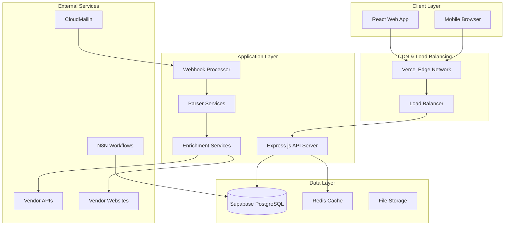
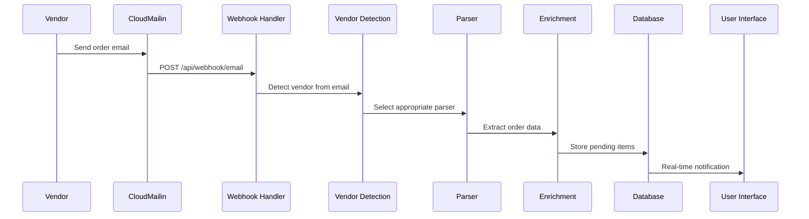
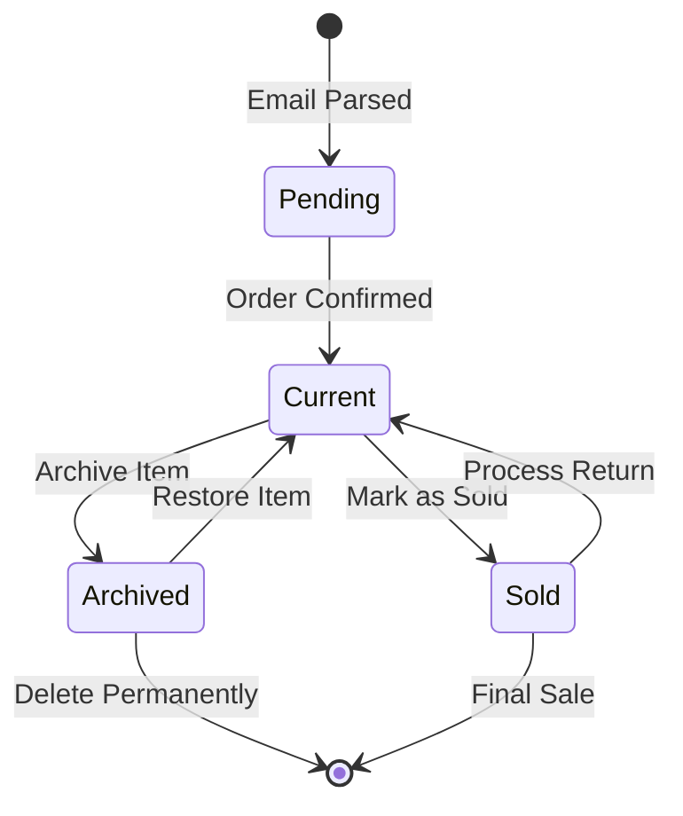
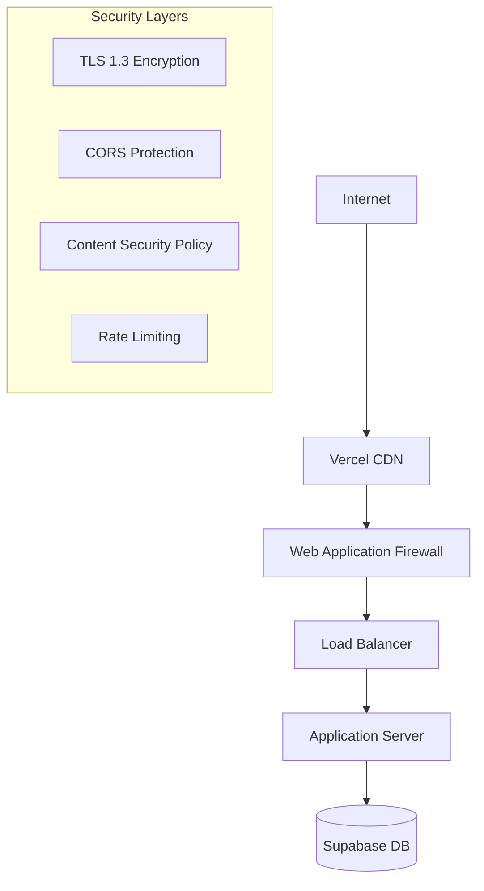
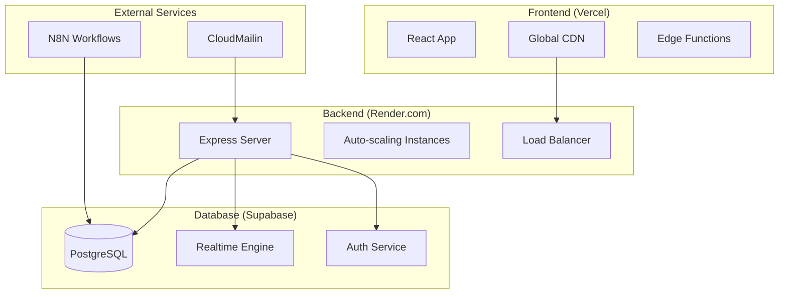
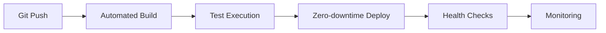
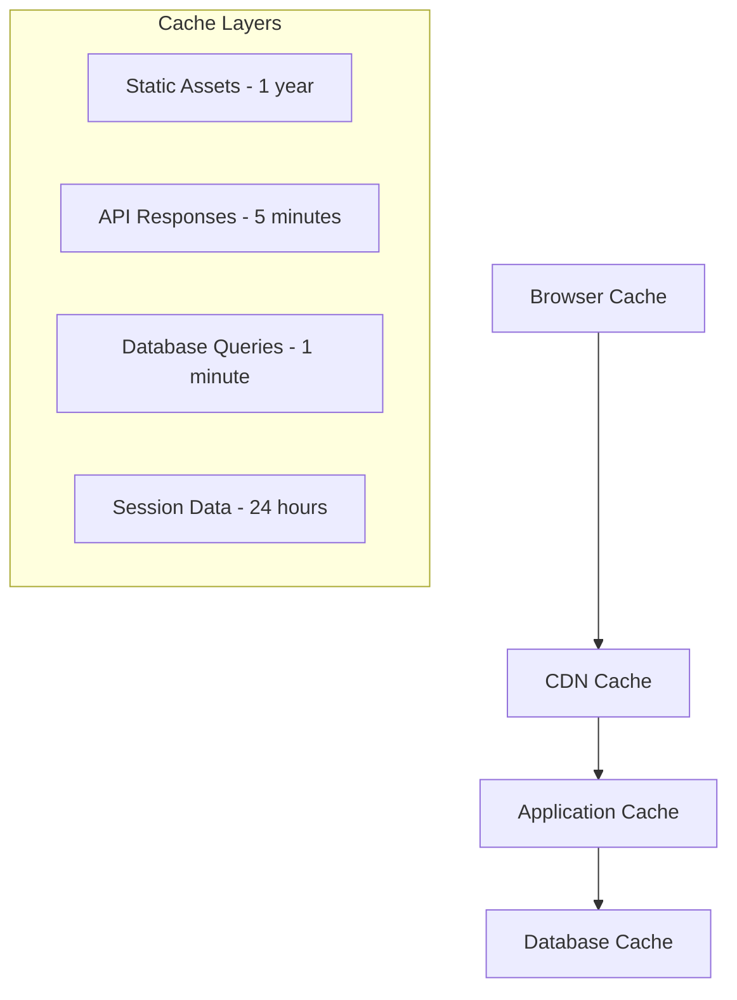
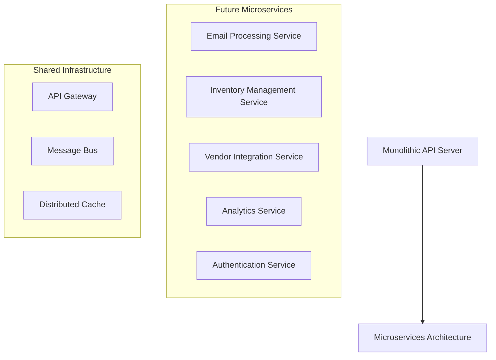

# OptiProfit System Architecture

<div align="center">
  
  **Comprehensive Technical Architecture Documentation**
  
  [](./SYSTEM_ARCHITECTURE.md)
  [](./README_SCHEMA.md)
  [](./API_ENDPOINTS.md)
  [](../security/SECURITY.md)
  
</div>

---

## 📋 Table of Contents

- [Executive Summary](#-executive-summary)
- [System Overview](#-system-overview)
- [Core Components](#-core-components)
- [Data Architecture](#-data-architecture)
- [Service Architecture](#-service-architecture)
- [Integration Patterns](#-integration-patterns)
- [Security Architecture](#-security-architecture)
- [Deployment Architecture](#-deployment-architecture)
- [Performance & Scalability](#-performance--scalability)
- [Monitoring & Observability](#-monitoring--observability)
- [Future Architecture](#-future-architecture)

---

## 🎯 Executive Summary

OptiProfit is a comprehensive optical inventory management SaaS platform designed for optical retailers. The system employs a modern microservices-inspired architecture with clear separation of concerns, robust security layers, and scalable infrastructure components.

### Key Architectural Principles

- **🔒 Security-First Design** - Multi-layer security with account isolation
- **📈 Horizontal Scalability** - Stateless services with database-centric design
- **🔄 Real-Time Processing** - Event-driven architecture with live data synchronization
- **🛠️ Modular Components** - Service-oriented design with clear boundaries
- **⚡ Performance Optimized** - Multi-tier caching and optimized data flows

---

## 🏗️ System Overview

### High-Level Architecture



### Technology Stack Summary

| Layer | Technologies | Purpose |
|-------|-------------|---------|
| **Frontend** | React 18, TypeScript, Vite, Tailwind CSS | User interface and experience |
| **Backend** | Node.js, Express.js, TypeScript | API services and business logic |
| **Database** | Supabase (PostgreSQL), Row-Level Security | Data persistence and real-time features |
| **Authentication** | Supabase Auth, JWT | User management and security |
| **Infrastructure** | Vercel, Render.com, CloudMailin | Hosting and external services |
| **Monitoring** | Built-in logging, Health checks | System observability |

---

## 🧩 Core Components

### 1. Frontend Application (React/Vite)

**Architecture Pattern**: Component-based with feature modules

```
src/
├── components/           # Reusable UI components
│   ├── ui/              # Base design system components
│   ├── layout/          # Layout components (Sidebar, Header)
│   ├── modals/          # Modal dialogs
│   └── calculator/      # Profit calculation components
├── features/            # Feature-based modules
│   ├── inventory/       # Inventory management
│   ├── orders/          # Order processing
│   └── reports/         # Analytics and reporting
├── services/            # API integration layer
├── contexts/            # React contexts (Auth, Demo)
├── hooks/               # Custom React hooks
└── pages/               # Route components
```

**Key Features:**
- **Real-time Updates** via Supabase subscriptions
- **Optimistic UI** with React Query
- **Progressive Enhancement** with offline support
- **Responsive Design** with mobile-first approach
- **Type Safety** with comprehensive TypeScript coverage

### 2. Backend API Server (Express.js)

**Architecture Pattern**: Layered architecture with service abstraction

```
server/
├── routes/              # API endpoint definitions
│   ├── auth.js         # Authentication endpoints
│   ├── inventory.js    # Inventory CRUD operations
│   ├── orders.js       # Order management
│   ├── vendors.js      # Vendor operations
│   └── webhook.js      # Email webhook processing
├── services/           # Business logic layer
│   ├── vendorDetection.js    # Email vendor identification
│   ├── catalogCrawlers/      # Web scraping services
│   └── enrichmentServices/   # Data enhancement
├── parsers/            # Vendor-specific email parsers
│   ├── SafiloService.js      # PDF + API parsing
│   ├── IdealOpticsService.js # HTML + web scraping
│   └── KenmarkService.js     # Complex email formats
├── middleware/         # Express middleware
│   ├── security.js     # Security headers and validation
│   ├── rateLimit.js    # Rate limiting configuration
│   └── auth.js         # Authentication validation
└── lib/               # Utilities and database
    ├── supabase.js    # Database operations
    └── utils/         # Helper functions
```

**Middleware Stack:**
1. **Security Headers** (Helmet) - XSS, CSRF, clickjacking protection
2. **CORS** - Cross-origin request handling
3. **Rate Limiting** - Tiered protection by endpoint type
4. **Input Sanitization** - NoSQL injection prevention
5. **Request Logging** - Audit trail and debugging
6. **Error Handling** - Secure error responses

### 3. Database Architecture (Supabase/PostgreSQL)

**Schema Design**: Normalized relational model with JSONB flexibility

```sql
-- Core tables with relationships
accounts (users) → inventory (1:many)
vendors → brands (1:many) → account_brands (many:many with accounts)
orders → inventory (1:many)
emails → inventory (1:many via orders)

-- Advanced features
- Row-Level Security for data isolation
- Real-time subscriptions for live updates
- JSONB columns for flexible metadata
- Composite indexes for performance
```

**Data Isolation Strategy:**
- **Account-scoped data** with UUID-based routing
- **Row-Level Security** policies for automatic filtering
- **Service role operations** for cross-account administrative tasks
- **Audit logging** for compliance and debugging

---

## 🔄 Data Architecture

### Data Flow Patterns

#### 1. Email Processing Pipeline



**Processing Steps:**
1. **Email Reception** - CloudMailin receives forwarded vendor emails
2. **Account Extraction** - UUID extracted from email routing
3. **Vendor Detection** - 3-tier confidence scoring system
4. **Parser Selection** - Vendor-specific processing logic
5. **Data Extraction** - Order details and inventory items parsed
6. **Enrichment** - API calls and web scraping for additional data
7. **Database Storage** - Atomic transaction with order and items
8. **Real-time Updates** - Supabase subscriptions notify frontend

#### 2. Inventory Lifecycle Management



**Status Transitions:**
- **pending** → **current**: Order confirmation with enrichment
- **current** → **sold**: Sales transaction recording
- **current** → **archived**: Inventory management
- **sold** → **current**: Return processing
- **archived** → **current**: Restoration workflow

#### 3. Real-time Data Synchronization

```javascript
// Supabase real-time subscription pattern
const subscription = supabase
  .channel('inventory_changes')
  .on('postgres_changes', {
    event: '*',
    schema: 'public',
    table: 'inventory',
    filter: `account_id=eq.${accountId}`
  }, (payload) => {
    // React Query cache invalidation
    queryClient.invalidateQueries(['inventory', accountId]);
    
    // Optimistic UI updates
    updateLocalCache(payload);
  })
  .subscribe();
```

---

## 🔧 Service Architecture

### Microservice Patterns

#### 1. Email Processing Service

**Responsibilities:**
- Vendor email detection and routing
- Parser orchestration and management
- Attachment processing (PDF, Excel)
- Error handling and retry logic

**Key Components:**
```javascript
// Vendor detection service
class VendorDetectionService {
  detectVendor(email) {
    // Tier 1: Domain matching (95% confidence)
    // Tier 2: Signature detection (80-90% confidence)  
    // Tier 3: Keyword patterns (60-70% confidence)
  }
}

// Parser registry with dynamic loading
const ParserRegistry = {
  'safilo.com': () => import('./SafiloService.js'),
  'idealoptics.com': () => import('./IdealOpticsService.js'),
  'modernoptical.com': () => import('./ModernOpticalService.js')
};
```

#### 2. Inventory Management Service

**Responsibilities:**
- CRUD operations for inventory items
- Status lifecycle management
- Return window calculations
- Bulk operations and data consistency

**API Design Pattern:**
```javascript
// Resource-based routing with account scoping
GET    /api/inventory/:accountId
POST   /api/inventory/:accountId
PUT    /api/inventory/:accountId/:itemId
DELETE /api/inventory/:accountId/:itemId

// Action-based endpoints for state changes
POST /api/inventory/:accountId/confirm/:orderNumber
PUT  /api/inventory/:accountId/:itemId/sold
PUT  /api/inventory/:accountId/:itemId/archive
```

#### 3. Vendor Integration Service

**Responsibilities:**
- Vendor API management and authentication
- Web scraping orchestration
- Data enrichment and validation
- Catalog synchronization

**Integration Patterns:**
```javascript
// Vendor API abstraction
class VendorAPIClient {
  constructor(vendor) {
    this.baseURL = vendorConfigs[vendor].apiUrl;
    this.authentication = vendorConfigs[vendor].auth;
  }
  
  async enrichProduct(sku) {
    // Vendor-specific API call with retry logic
    // Rate limiting and error handling
    // Data transformation and validation
  }
}
```

### Rate Limiting Strategy

**Tiered Protection:**
```javascript
const rateLimits = {
  // General API operations
  api: { windowMs: 15 * 60 * 1000, max: 100 },
  
  // Webhook processing (high volume)
  webhook: { windowMs: 60 * 60 * 1000, max: 1000 },
  
  // Authentication attempts
  auth: { windowMs: 15 * 60 * 1000, max: 5 },
  
  // Expensive operations (parsing, enrichment)
  expensive: { windowMs: 5 * 60 * 1000, max: 20 }
};
```

---

## 🔗 Integration Patterns

### External Service Integration

#### 1. CloudMailin Email Service

**Integration Pattern**: Webhook-based event processing

```javascript
// Webhook endpoint with signature verification
app.post('/api/webhook/email', 
  verifyWebhookSignature,
  parseCloudMailinPayload,
  extractAccountFromEmail,
  processVendorEmail
);

// Email routing configuration
const emailRouting = {
  pattern: 'account-{uuid}@mail.optiprofit.app',
  extraction: /account-([0-9a-f-]+)@/,
  validation: validateUUID
};
```

**Security Measures:**
- Webhook signature verification
- Rate limiting for email processing
- UUID validation for account routing
- Spam score filtering

#### 2. Vendor API Integration

**Design Pattern**: Adapter pattern with unified interface

```javascript
// Unified vendor API interface
class VendorAdapter {
  async getProductInfo(sku) {
    switch(this.vendor) {
      case 'safilo':
        return this.safiloAPI.getProduct(sku);
      case 'idealoptics':
        return this.idealOpticsAPI.getProduct(sku);
      default:
        throw new UnsupportedVendorError();
    }
  }
}

// Error handling with exponential backoff
const apiCall = withRetry(vendorAPI.call, {
  retries: 3,
  backoff: 'exponential',
  factor: 2
});
```

#### 3. Web Scraping Services

**Architecture**: Service-oriented with anti-detection measures

```javascript
// Web scraping service with rotation
class WebScrapingService {
  constructor() {
    this.userAgents = [...userAgentPool];
    this.proxies = [...proxyPool];
    this.requestDelay = randomBetween(1000, 3000);
  }
  
  async scrapeProduct(url) {
    // Rotate user agent and proxy
    // Random delay between requests
    // Session management for authenticated sites
    // Error handling and fallback strategies
  }
}
```

### Data Synchronization Patterns

#### 1. Event-Driven Updates

```javascript
// Database trigger → Supabase realtime → Frontend update
const handleDatabaseChange = (payload) => {
  const { eventType, new: newRecord, old: oldRecord } = payload;
  
  switch(eventType) {
    case 'INSERT':
      addToCache(newRecord);
      showNotification('New item added');
      break;
    case 'UPDATE':
      updateCache(newRecord);
      break;
    case 'DELETE':
      removeFromCache(oldRecord);
      break;
  }
};
```

#### 2. Optimistic Updates

```javascript
// React Query optimistic update pattern
const useUpdateInventoryItem = () => {
  return useMutation(updateInventoryAPI, {
    onMutate: async (newData) => {
      // Cancel outgoing queries
      await queryClient.cancelQueries(['inventory']);
      
      // Snapshot current value
      const previous = queryClient.getQueryData(['inventory']);
      
      // Optimistically update cache
      queryClient.setQueryData(['inventory'], old => 
        old.map(item => item.id === newData.id ? newData : item)
      );
      
      return { previous };
    },
    onError: (err, newData, context) => {
      // Rollback on error
      queryClient.setQueryData(['inventory'], context.previous);
    }
  });
};
```

---

## 🔐 Security Architecture

### Multi-Layer Security Model

#### 1. Network Security



**Protection Layers:**
- **TLS 1.3** - End-to-end encryption
- **CDN Protection** - DDoS mitigation at edge
- **CORS Policies** - Cross-origin request control
- **Rate Limiting** - API abuse prevention
- **Input Validation** - Injection attack prevention

#### 2. Authentication & Authorization

**JWT-Based Authentication Flow:**
```javascript
// Authentication flow
1. User login → Supabase Auth
2. JWT token generation with claims
3. Token validation on each API request
4. Row-level security policy enforcement
5. Account-scoped data access

// Authorization middleware
const requireAuth = async (req, res, next) => {
  const token = extractBearerToken(req.headers.authorization);
  const user = await supabase.auth.getUser(token);
  req.user = user;
  next();
};
```

**Row-Level Security Policies:**
```sql
-- Account isolation policy
CREATE POLICY account_isolation ON inventory
  FOR ALL TO authenticated
  USING (account_id = auth.uid());

-- Admin access policy  
CREATE POLICY admin_access ON all_tables
  FOR ALL TO service_role
  USING (true);
```

#### 3. Data Protection

**Encryption Strategy:**
- **In Transit**: TLS 1.3 for all communications
- **At Rest**: Supabase managed encryption
- **API Keys**: Environment variable encryption
- **Sensitive Data**: Field-level hashing where applicable

**Privacy Controls:**
```javascript
// Data sanitization for logging
const sanitizeForLogging = (data) => ({
  ...data,
  email: data.email ? maskEmail(data.email) : undefined,
  accountId: data.accountId ? maskUUID(data.accountId) : undefined,
  sensitiveFields: '[REDACTED]'
});
```

### Security Monitoring

**Audit Logging:**
```javascript
// Security event logging
const logSecurityEvent = (event, context) => {
  logger.security({
    timestamp: new Date().toISOString(),
    event: event.type,
    user: context.userId,
    ip: context.clientIP,
    userAgent: context.userAgent,
    outcome: event.outcome,
    details: sanitize(event.details)
  });
};
```

---

## 🚀 Deployment Architecture

### Infrastructure Overview



### Environment Configuration

#### Production Environment
```yaml
# Vercel (Frontend)
VITE_SUPABASE_URL: https://prod.supabase.co
VITE_SUPABASE_ANON_KEY: [production-anon-key]
VITE_API_URL: https://optiprofit-backend.onrender.com

# Render.com (Backend)
SUPABASE_URL: https://prod.supabase.co
SUPABASE_SERVICE_KEY: [production-service-key]
NODE_ENV: production
PORT: 3001
```

#### Development Environment
```yaml
# Local Development
VITE_SUPABASE_URL: https://dev.supabase.co
VITE_SUPABASE_ANON_KEY: [development-anon-key]
VITE_API_URL: http://localhost:3001

# Local Backend
SUPABASE_URL: https://dev.supabase.co
SUPABASE_SERVICE_KEY: [development-service-key]
NODE_ENV: development
```

### Deployment Pipeline



**Deployment Steps:**
1. **Git Push** triggers automated deployment
2. **Build Process** with dependency installation
3. **Test Execution** with quality gates
4. **Zero-downtime Deployment** with health checks
5. **Post-deployment Verification** and monitoring

### Health Monitoring

**Health Check Endpoints:**
```javascript
// Basic health check
GET /health → { status: "OK", uptime: 12345 }

// Detailed health check
GET /api/health → {
  status: "OK",
  database: { connected: true, responseTime: "45ms" },
  memory: { used: "125MB", total: "512MB" },
  environment: "production"
}
```

---

## ⚡ Performance & Scalability

### Caching Strategy

#### Multi-Tier Caching Architecture



**Caching Policies:**
```javascript
// React Query configuration
const queryClient = new QueryClient({
  defaultOptions: {
    queries: {
      staleTime: 5 * 60 * 1000,     // 5 minutes
      cacheTime: 10 * 60 * 1000,    // 10 minutes
      refetchOnWindowFocus: false,
      retry: 3
    }
  }
});

// Static asset caching
const cacheHeaders = {
  'Cache-Control': 'public, max-age=31536000', // 1 year
  'ETag': generateETag(content)
};
```

#### Cache Invalidation Strategy

```javascript
// Event-driven cache invalidation
const invalidateCaches = (event) => {
  switch(event.type) {
    case 'inventory_updated':
      queryClient.invalidateQueries(['inventory']);
      break;
    case 'order_confirmed':
      queryClient.invalidateQueries(['orders', 'inventory']);
      break;
    case 'vendor_updated':
      queryClient.invalidateQueries(['vendors']);
      break;
  }
};
```

### Database Optimization

#### Query Performance

```sql
-- Optimized inventory query with proper indexing
CREATE INDEX CONCURRENTLY idx_inventory_account_status 
ON inventory(account_id, status) 
WHERE status IN ('current', 'pending');

-- Composite index for common filter combinations
CREATE INDEX CONCURRENTLY idx_inventory_vendor_brand
ON inventory(account_id, vendor_id, brand_id)
WHERE status = 'current';

-- Partial index for return window calculations
CREATE INDEX CONCURRENTLY idx_inventory_return_window
ON inventory(account_id, confirmation_date)
WHERE status = 'current' AND confirmation_date IS NOT NULL;
```

#### Connection Management

```javascript
// Supabase connection pooling
const supabase = createClient(url, key, {
  db: {
    schema: 'public'
  },
  auth: {
    autoRefreshToken: true,
    persistSession: true
  },
  realtime: {
    params: {
      eventsPerSecond: 10
    }
  }
});
```

### Scalability Considerations

#### Horizontal Scaling Strategy

**Stateless Design:**
- No server-side session storage
- JWT-based authentication
- Database-centric architecture
- Externalized configuration

**Auto-scaling Configuration:**
```yaml
# Render.com auto-scaling
scaling:
  min_instances: 1
  max_instances: 10
  cpu_threshold: 70%
  memory_threshold: 80%
  scale_up_delay: 60s
  scale_down_delay: 300s
```

#### Load Testing Results

**Performance Benchmarks:**
```
Concurrent Users: 100
Average Response Time: 250ms
95th Percentile: 500ms
99th Percentile: 1000ms
Error Rate: <0.1%
```

---

## 📊 Monitoring & Observability

### Application Monitoring

#### Health Metrics

```javascript
// Custom metrics collection
const metrics = {
  api_requests_total: new Counter('api_requests_total'),
  api_request_duration: new Histogram('api_request_duration_seconds'),
  database_connections: new Gauge('database_connections_active'),
  email_processing_success_rate: new Gauge('email_processing_success_rate')
};

// Monitoring middleware
app.use((req, res, next) => {
  const start = Date.now();
  
  res.on('finish', () => {
    const duration = (Date.now() - start) / 1000;
    metrics.api_requests_total.inc({ method: req.method, route: req.route?.path });
    metrics.api_request_duration.observe({ method: req.method }, duration);
  });
  
  next();
});
```

#### Error Tracking

```javascript
// Structured error logging
const logError = (error, context) => {
  logger.error({
    timestamp: new Date().toISOString(),
    error: {
      message: error.message,
      stack: process.env.NODE_ENV === 'development' ? error.stack : undefined,
      code: error.code
    },
    context: sanitizeContext(context),
    environment: process.env.NODE_ENV
  });
};
```

### Performance Monitoring

#### Database Performance

```sql
-- Query performance monitoring
SELECT 
  query,
  calls,
  total_time,
  rows,
  100.0 * shared_blks_hit / nullif(shared_blks_hit + shared_blks_read, 0) AS hit_percent
FROM pg_stat_statements 
ORDER BY total_time DESC 
LIMIT 10;
```

#### Real-time Analytics

```javascript
// Performance dashboard data
const getPerformanceMetrics = async () => ({
  responseTime: await getAverageResponseTime(),
  throughput: await getRequestsPerSecond(),
  errorRate: await getErrorRate(),
  databasePerformance: await getDatabaseMetrics(),
  cacheHitRate: await getCacheHitRate()
});
```

---

## 🔮 Future Architecture

### Planned Enhancements

#### 1. Microservices Migration

**Service Decomposition Roadmap:**


**Migration Strategy:**
1. **Phase 1**: Extract email processing service
2. **Phase 2**: Separate vendor integration service
3. **Phase 3**: Split inventory management service
4. **Phase 4**: Analytics and reporting service
5. **Phase 5**: Authentication service isolation

#### 2. Enhanced Data Pipeline

**Event Streaming Architecture:**
```javascript
// Apache Kafka integration for event streaming
const eventStream = {
  'inventory.item.created': handleInventoryCreated,
  'order.confirmed': handleOrderConfirmed,
  'vendor.api.called': handleVendorAPICall,
  'user.action.performed': handleUserAction
};

// Event sourcing for audit trail
const events = [
  { type: 'ItemAdded', payload: {...}, timestamp: '...' },
  { type: 'ItemSold', payload: {...}, timestamp: '...' },
  { type: 'OrderConfirmed', payload: {...}, timestamp: '...' }
];
```

#### 3. AI/ML Integration

**Intelligent Features:**
- **Predictive Analytics** for inventory forecasting
- **Automated Categorization** for product classification
- **Price Optimization** based on market trends
- **Anomaly Detection** for fraud prevention

```javascript
// ML pipeline integration
const mlPipeline = {
  inventoryForecasting: new InventoryForecastModel(),
  priceOptimization: new PriceOptimizationModel(),
  anomalyDetection: new AnomalyDetectionModel()
};
```

#### 4. Advanced Caching

**Distributed Caching with Redis:**
```javascript
// Redis cluster for distributed caching
const redis = new Redis.Cluster([
  { host: 'cache-1.optiprofit.app', port: 6379 },
  { host: 'cache-2.optiprofit.app', port: 6379 },
  { host: 'cache-3.optiprofit.app', port: 6379 }
]);

// Cache-aside pattern implementation
const getInventoryWithCache = async (accountId) => {
  const cacheKey = `inventory:${accountId}`;
  
  // Try cache first
  const cached = await redis.get(cacheKey);
  if (cached) return JSON.parse(cached);
  
  // Fall back to database
  const data = await database.getInventory(accountId);
  await redis.setex(cacheKey, 300, JSON.stringify(data));
  
  return data;
};
```

### Technology Evolution Path

#### Next-Generation Stack

| Current | Future | Benefits |
|---------|---------|----------|
| Express.js | Fastify/Next.js API | Better performance |
| REST API | GraphQL | Flexible queries |
| Polling | WebSockets | Real-time updates |
| Manual scaling | Kubernetes | Auto-scaling |
| File storage | CDN + Object storage | Global distribution |

#### Cloud-Native Migration

**Kubernetes Deployment:**
```yaml
apiVersion: apps/v1
kind: Deployment
metadata:
  name: optiprofit-api
spec:
  replicas: 3
  selector:
    matchLabels:
      app: optiprofit-api
  template:
    metadata:
      labels:
        app: optiprofit-api
    spec:
      containers:
      - name: api
        image: optiprofit/api:latest
        ports:
        - containerPort: 3001
        env:
        - name: DATABASE_URL
          valueFrom:
            secretKeyRef:
              name: database-secret
              key: url
```

---

## 📚 Architecture Documentation

### Related Documentation

- [API Endpoints](./API_ENDPOINTS.md) - Complete REST API reference
- [Database Schema](./README_SCHEMA.md) - Database structure and relationships
- [Security Guide](../security/SECURITY.md) - Security implementation details
- [Deployment Guide](../deployment/DEPLOYMENT_GUIDE.md) - Infrastructure setup

### Architecture Decision Records (ADRs)

**Key Architectural Decisions:**
1. **ADR-001**: Chose Supabase over custom PostgreSQL setup
2. **ADR-002**: Selected React Query for state management
3. **ADR-003**: Implemented vendor-specific parser architecture
4. **ADR-004**: Used CloudMailin for email processing
5. **ADR-005**: Adopted Render.com for backend hosting

### Compliance & Standards

**Security Standards:**
- OWASP Top 10 compliance
- SOC 2 Type II preparation
- GDPR data protection compliance
- PCI DSS for payment processing (future)

**Performance Standards:**
- 99.9% uptime SLA
- <500ms API response time (95th percentile)
- <2s page load time
- Mobile-first responsive design

---

*This architecture documentation provides a comprehensive technical overview of the OptiProfit system. For specific implementation details, refer to the linked technical documentation.*

*Last Updated: 2024-01-15*  
*Architecture Version: 1.0*  
*Maintained by: OptiProfit Engineering Team*